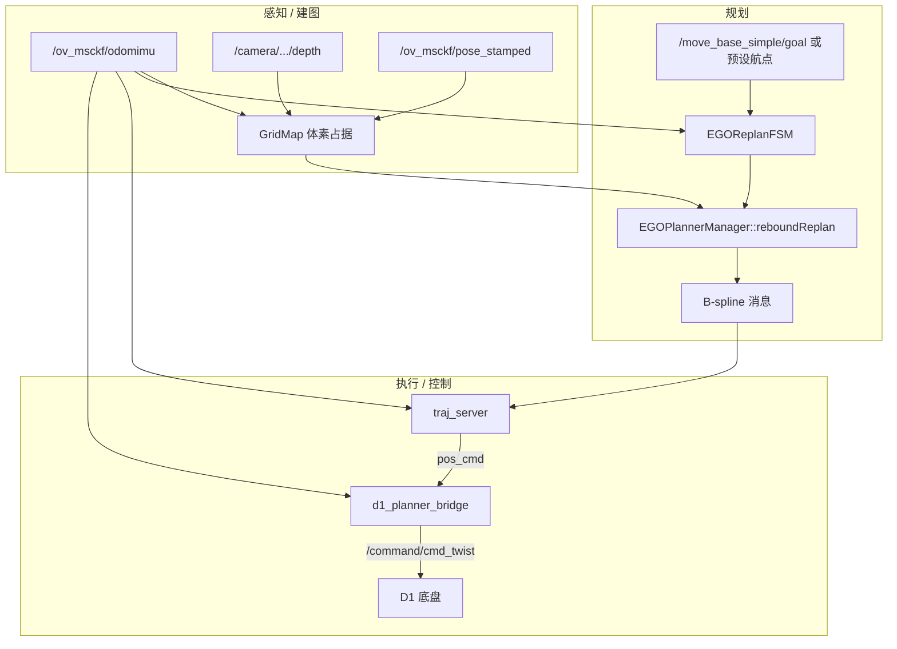
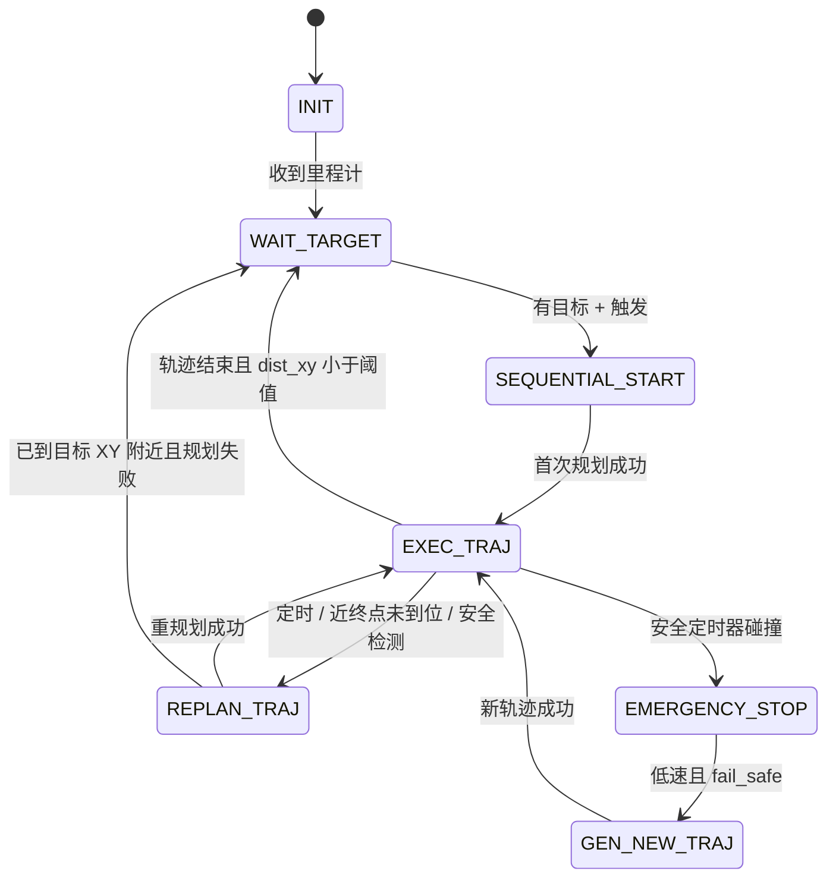
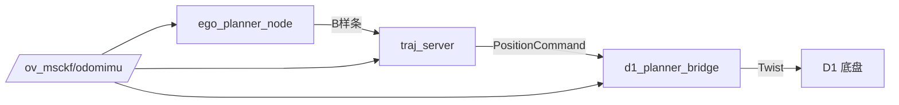

# EGO Planner × D1：系统总览

本文描述本仓库在 **D1 地面机器人实机** 场景下的整体数据流：深度建图、规划状态机、轨迹采样与底盘控制。数学细节见：

- [规划数学原理](01_planning_math.md)
- [控制数学原理](02_control_math.md)

---

## 1. 系统架构

EGO Planner 原为四旋翼 3D 避障规划器。本仓库将其适配为 **固定高度平面运动** 的差速底盘：规划在 XY 平面进行，高度 $z$ 锁定为当前 VIO 里程计高度；执行层通过 `traj_server` 与 `d1_planner_bridge` 将 B 样条轨迹转为 `cmd_vel`。



### 关键 ROS 话题

| 话题 | 类型 | 生产者 | 消费者 | 说明 |
|------|------|--------|--------|------|
| `/ov_msckf/odomimu` | `nav_msgs/Odometry` | OpenVINS | 规划、traj_server、bridge | 位姿与速度闭环（global 系） |
| `/ov_msckf/pose_stamped` | `geometry_msgs/PoseStamped` | OpenVINS | `GridMap` | 与深度图同步投影建图 |
| `/camera/camera/depth/image_rect_raw` | `sensor_msgs/Image` | RealSense | `GridMap` | 深度图（16UC1 mm） |
| `/move_base_simple/goal` | `geometry_msgs/PoseStamped` | RViz | FSM | RViz 2D Goal 设目标 |
| `drone_0_planning/bspline` | `traj_utils/Bspline` | `ego_planner_node` | `traj_server` | 优化后的轨迹 |
| `/drone_0_planning/pos_cmd` | `quadrotor_msgs/PositionCommand` | `traj_server` | `d1_planner_bridge` | 位置/速度/加速度/yaw |
| `/command/cmd_twist` | `geometry_msgs/Twist` | bridge | D1 控制器 | 仅 `linear.x`、`angular.z` |

### 建议启动顺序

```bash
ros2 launch ov_msckf d435i_openvins.launch.py
ros2 launch ego_planner single_run.launch.py
ros2 launch d1_planner_bridge d1_planner_bridge.launch.py
ros2 launch ego_planner rviz.launch.py   # 可选
```

---

## 2. 感知与建图

EGO **不加载静态地图**，而是在线维护 3D 体素栅格（`GridMap`，`plan_env` 包）。

### 2.1 输入

| 数据 | 话题（默认） | 作用 |
|------|-------------|------|
| 里程计 | `/ov_msckf/odomimu` | 机器人 global 系位姿；划定局部地图更新范围 |
| 深度图 | `/camera/camera/depth/image_rect_raw` | 射线投射标占据体素 |
| 相机位姿 | `/ov_msckf/pose_stamped` | 与深度图时间同步，投影到世界系 |

### 2.2 处理流程

1. 里程计更新相机/机体位置，确定以机器人为中心的局部更新窗口。
2. `depthPoseCallback` 将深度像素经相机内参投影为世界系点，再经 raycast 写入占据栅格。
3. 规划器查询 `getInflateOccupancy(pos)` 做 A* 与 B 样条避障代价。

### 2.3 与 D1 平面规划的关系

地面机在 **`manager/use_robot_z_planning:=true`**（默认）时，碰撞检测将查询点 $z$ 替换为 `planning_z_`（当前 odom 高度），等价于在 **固定高度切片** 上做 XY 避障。详见 [规划文档 §6](01_planning_math.md#6-d1-改动固定-z-的-25d-规划)。

---

## 3. 规划状态机（FSM）

`EGOReplanFSM` 每 10 ms 执行一次，决定何时规划、重规划、执行或停车。

### 3.1 状态一览

| 状态 | 含义 |
|------|------|
| `INIT` | 启动，等待里程计 |
| `WAIT_TARGET` | 有定位，等待 RViz 目标或预设航点触发 |
| `SEQUENTIAL_START` | 首次规划（单机也走此状态） |
| `GEN_NEW_TRAJ` | 从全局路径重新生成轨迹（如紧急停车后） |
| `REPLAN_TRAJ` | **局部重规划**（warm-start + odom 锚定） |
| `EXEC_TRAJ` | 执行已发布 B 样条 |
| `EMERGENCY_STOP` | 碰撞风险，发布停车轨迹 |

### 3.2 典型状态转移（单机 D1）



### 3.3 目标来源

- RViz **2D Goal** → `/move_base_simple/goal`
- `enable_tag_tracking=true`：AprilTag 跟随（launch 参数）

### 3.4 重规划与到达判定（相对原版的重要改动）

| 机制 | 行为 |
|------|------|
| **首次规划** | `planFromGlobalTraj`：`flag_polyInit=true`，从里程计到局部目标生成多项式初值 |
| **局部重规划** | `REPLAN_TRAJ` → `planFromCurrentTraj`：`flag_polyInit=false`，沿上一段 B 样条 warm-start，**前 3 个控制点钉在 odom** |
| **规划起点** | `start_pt_ = odom_pos_`，`start_vel_ = odom_vel_`（不用轨迹上的预测状态） |
| **固定 z** | 每次 `callReboundReplan` 调用 `setRobotPlanningZ(odom_z)`，局部目标 z 也设为 odom z |
| **到达判定** | **仅 XY**：`dist_to_goal_xy < goal_reach_thresh`（默认 0.3 m），适配慢速地面机 |
| **定时重规划** | `t_wall > thresh_replan_time`（D1 默认 2.5 s）进入 `REPLAN_TRAJ` |

相关 commit 演进见 [规划文档 §7](01_planning_math.md#7-近期-commit-与行为变更)。

---

## 4. 轨迹执行与控制链路

规划输出 B 样条后，执行分为两级：



### 4.1 `traj_server`（轨迹采样）

- 对 B 样条 De Boor 求值得 $\mathbf{p}, \mathbf{v}, \mathbf{a}$
- D1 默认 **`use_odom_progress=true`**：用 odom XY 在轨迹上找最近点，再前瞻采样，避免“墙钟时间播完车还没走到”
- 发布 `PositionCommand`（含 `yaw`、`yaw_dot`）

详见 [控制文档 §2](02_control_math.md#2-traj_server轨迹采样与-yaw)。

### 4.2 `d1_planner_bridge`（差速跟踪）

- 世界系速度前馈 → 车体 `linear.x`
- 航向 P + `yaw_dot` 前馈 → `angular.z`
- 横向误差 P 纠偏；大航向误差时原地转向
- `cmd_vel_ema_alpha` 平滑重规划跳变

详见 [控制文档 §3](02_control_math.md#3-d1_planner_bridge-控制律)。

---

## 5. 日志与调参入口

### 5.1 终端日志

一键启动时日志由 `start_ego_stack.sh` 写入 `ego_log/stack_YYYYMMDD_HHMMSS/`（各节点独立 `.log` 文件）。

单独 `ros2 launch` 时输出在终端；需要落盘请用 `./start_ego_stack.sh`。

| 标签 | 节点 | 内容 |
|------|------|------|
| `[bspline_publish]` / `[bspline_rx]` | planner / traj_server | B 样条与 odom、终点 |
| `[pos_cmd_pub]` | traj_server | 采样点与速度 |
| `[exec_trace]` / `[goal_reached]` | planner | 执行进度与到达 |
| `[cmd_vel_pub]` | bridge | odom、twist、横向误差 |

### 5.2 主要参数文件

| 文件 | 内容 |
|------|------|
| `src/planner/plan_manage/launch/single_run.launch.py` | 地图、速度、重规划周期、traj_server |
| `src/planner/plan_manage/launch/advanced_param.launch.py` | 优化权重、膨胀、FSM 阈值 |
| `src/d1_planner_bridge/config/d1_bridge.yaml` | 底盘跟踪增益与限幅 |

### 5.3 常见“一冲一停”

| 现象 | 可先试 |
|------|--------|
| `linear.x` 长期过小 | `d1_bridge.yaml` 增大 `min_vx` |
| `yaw_dot` 尖峰 | 降低 `max_yaw_dot_ff`、`yaw_kp` |
| 周期性顿挫 | 增大 `thresh_replan_time` |
| 未对准仍前进 | 检查 `align_heading_thresh_rad` |
| 跟不上轨迹 | 增大 `odom_lookahead_time` |

---

## 6. 源码索引

| 模块 | 路径 |
|------|------|
| 占据地图 | `src/planner/plan_env/` |
| B 样条优化 | `src/planner/bspline_opt/` |
| A* | `src/planner/path_searching/` |
| FSM / 规划管理 | `src/planner/plan_manage/` |
| 轨迹服务 | `src/planner/plan_manage/src/traj_server.cpp` |
| D1 桥接 | `src/d1_planner_bridge/` |

---

## 7. 文档索引

| 文档 | 内容 |
|------|------|
| [00_overview.md](00_overview.md) | 本文：系统总览 |
| [01_planning_math.md](01_planning_math.md) | B 样条、代价函数、L-BFGS、2D 改动 |
| [02_control_math.md](02_control_math.md) | odom 进度、跟踪律、参数 |
| [04_apriltag_integration.md](04_apriltag_integration.md) | AprilTag 感知迁入本仓、话题契约、一键启动 |
| [APRILTAG_TRACKING_INTEGRATION.md](../APRILTAG_TRACKING_INTEGRATION.md) | Tag 跟随 FSM（规划侧，已实现） |
