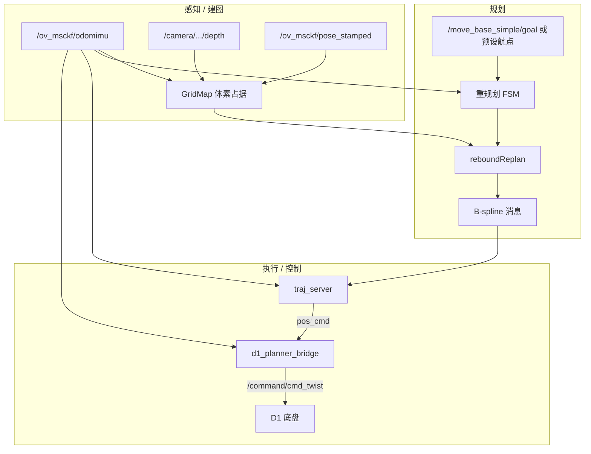
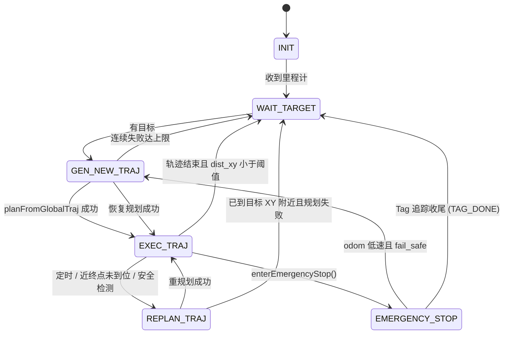
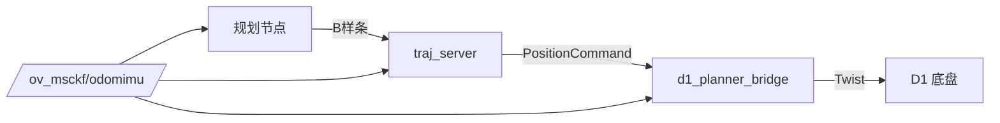

# D1 规划控制栈：系统总览

本文描述本仓库在 **D1 地面机器人实机** 场景下的整体数据流：深度建图、规划状态机、轨迹采样与底盘控制。数学细节见：

- [规划数学原理](01_planning_math.md)
- [控制数学原理](02_control_math.md)

---

## 1. 系统架构

本仓库实现一套面向差速底盘的 **在线避障局部规划**：深度建图 → 动态 A\* 引导初值 → 均匀 B 样条 + L-BFGS（平滑 / 避障 rebound / 可行性 / 终端）→ 轨迹采样 → `cmd_vel`。规划在 XY 平面进行，高度 $z$ 锁定为当前 VIO 里程计高度；碰撞查询支持 **高度柱（2.5D）**。


```mermaid
flowchart TB
  subgraph perception["感知 / 建图"]
    Odom["/ov_msckf/odomimu"]
    Depth["/camera/.../depth"]
    Pose["/ov_msckf/pose_stamped"]
    GM["GridMap 体素占据"]
    Odom --> GM
    Depth --> GM
    Pose --> GM
  end

  subgraph planning["规划"]
    Goal["/move_base_simple/goal 或预设航点"]
    FSM["重规划 FSM"]
    PM["reboundReplan"]
    Odom --> FSM
    Goal --> FSM
    GM --> PM
    FSM --> PM
    PM --> BS["B-spline 消息"]
  end

  subgraph execution["执行 / 控制"]
    TS["traj_server"]
    BR["d1_planner_bridge"]
    Robot["D1 底盘"]
    BS --> TS
    Odom --> TS
    TS -->|pos_cmd| BR
    Odom --> BR
    BR -->|/command/cmd_twist| Robot
  end
```

### 关键 ROS 话题

| 话题 | 类型 | 生产者 | 消费者 | 说明 |
|------|------|--------|--------|------|
| `/ov_msckf/odomimu` | `nav_msgs/Odometry` | OpenVINS | 规划、traj_server、bridge | 位姿与速度闭环（global 系） |
| `/ov_msckf/pose_stamped` | `geometry_msgs/PoseStamped` | OpenVINS | `GridMap` | 与深度图同步投影建图 |
| `/camera/camera/depth/image_rect_raw` | `sensor_msgs/Image` | RealSense | `GridMap` | 深度图（16UC1 mm） |
| `/move_base_simple/goal` | `geometry_msgs/PoseStamped` | RViz | FSM | RViz 2D Goal 设目标 |
| `drone_0_planning/bspline` | `traj_utils/Bspline` | 规划节点 | `traj_server` | 优化后的轨迹 |
| `/drone_0_planning/pos_cmd` | `quadrotor_msgs/PositionCommand` | `traj_server` | `d1_planner_bridge` | 位置/速度/加速度/yaw |
| `/command/cmd_twist` | `geometry_msgs/Twist` | bridge | D1 控制器 | 仅 `linear.x`、`angular.z` |

### 推荐启动方式

实机默认使用仓库根目录 **`start_ego_stack.sh`** 一键启动（与 [Readme.md](../Readme.md) 一致）：

```bash
./start_ego_stack.sh                        # RViz 手动设点
./start_ego_stack.sh enable_tag_tracking=true  # AprilTag 追踪
./start_ego_stack.sh --no-rviz
```

脚本内部：RealSense → OpenVINS → [可选 AprilTag] → 规划 launch → `d1_planner_bridge` → [可选 RViz]。等价手动命令见脚本内 `ros2 launch` 行。

### 手动分终端（调试）

与脚本等价、便于单独重启某一节点：按 `start_ego_stack.sh` 中的顺序分别启动 RealSense、OpenVINS、规划（`src/planner/plan_manage/launch/single_run.launch.py`）、桥接（`d1_planner_bridge.launch.py`）、可选 RViz（Fixed Frame: `global`）。

---

## 2. 感知与建图

规划栈 **不加载静态地图**，而是在线维护 3D 体素栅格（`GridMap`，`plan_env` 包）。

### 2.1 输入

| 数据 | 话题（默认） | 作用 |
|------|-------------|------|
| 里程计 | `/ov_msckf/odomimu` | 机器人 global 系位姿；划定局部地图更新范围 |
| 深度图 | `/camera/camera/depth/image_rect_raw` | 射线投射标占据体素 |
| 相机位姿 | `/ov_msckf/pose_stamped` | 与深度图时间同步，投影到世界系 |

### 2.2 处理流程

1. 里程计更新相机/机体位置，确定以机器人为中心的局部更新窗口。
2. `depthPoseCallback` 将深度像素经相机内参投影为世界系点，再经 raycast 写入占据栅格。
3. **地面滤波**（默认开）：相对估计地面高度低于 `obstacle_min_height` 的点当地板；凸起保留为障碍。
4. 规划器查询 `getInflateOccupancy(pos)`；开启 `column_collision_enable` 时对 $(x,y)$ 做 **高度柱** 检查。

### 2.3 与 D1 平面规划的关系

`manager/use_robot_z_planning:=true`（`d1_robot.yaml`）时，优化变量 $z$ 锚定为 `planning_z_`（当前 odom 高度）。碰撞语义见 [规划文档 §6](01_planning_math.md#6-d1-改动固定-z-与高度柱) 与 [地面障碍建模](06_ground_obstacle_modeling.md)。

---

## 3. 规划状态机（FSM）

重规划 FSM（`ego_replan_fsm.cpp`）每 10 ms 执行一次，决定何时规划、重规划、执行或停车。

### 3.1 状态一览

| 状态 | 含义 |
|------|------|
| `INIT` | 启动，等待里程计 |
| `WAIT_TARGET` | 有定位，等待 RViz 目标、预设航点或 AprilTag 触发 |
| `GEN_NEW_TRAJ` | 从全局路径生成/恢复轨迹（首次规划、急停恢复、安全兜底） |
| `REPLAN_TRAJ` | **局部重规划**（warm-start + odom 锚定） |
| `EXEC_TRAJ` | 执行已发布 B 样条 |
| `EMERGENCY_STOP` | 碰撞风险；`enterEmergencyStop()` 同步发布停车 B 样条 |

### 3.2 典型状态转移（单机 D1）


```mermaid
stateDiagram-v2
    [*] --> INIT
    INIT --> WAIT_TARGET: 收到里程计
    WAIT_TARGET --> GEN_NEW_TRAJ: 有目标
    GEN_NEW_TRAJ --> EXEC_TRAJ: planFromGlobalTraj 成功
    GEN_NEW_TRAJ --> WAIT_TARGET: 连续失败达上限
    EXEC_TRAJ --> REPLAN_TRAJ: 定时 / 近终点未到位 / 安全检测
    REPLAN_TRAJ --> EXEC_TRAJ: 重规划成功
    REPLAN_TRAJ --> WAIT_TARGET: 已到目标 XY 附近且规划失败
    EXEC_TRAJ --> WAIT_TARGET: 轨迹结束且 dist_xy 小于阈值
    EXEC_TRAJ --> EMERGENCY_STOP: enterEmergencyStop()
    EMERGENCY_STOP --> GEN_NEW_TRAJ: odom 低速且 fail_safe
    EMERGENCY_STOP --> WAIT_TARGET: Tag 追踪收尾 (TAG_DONE)
    GEN_NEW_TRAJ --> EXEC_TRAJ: 恢复规划成功
```

**急停与安全分层（与代码一致）：**

1. `enterEmergencyStop()` 进入 `EMERGENCY_STOP` 并发布 **6 个重合控制点** 的停车 B 样条。
2. 轨迹前方撞障且局部 replan 失败时走 **`[SAFETY_TIER]`**：先停车样条 / 全局重建进 `GEN_NEW_TRAJ`；仅当本体也在膨胀占据且逼近、或连续失败达 `safety_fail_estop_count` 时才正式急停。
3. `EMERGENCY_STOP` / `GEN_NEW_TRAJ` 下 **不对旧轨迹做前向扫描**，仅可选检查 odom 本体占据。
4. 急停恢复：`pending_estop_global_replan_` → `maybeReplanGlobalAfterEstop()`（漂移超 `global_replan_drift_thresh` 则重建全局路径）→ `planFromGlobalTraj`。

### 3.3 目标来源

- RViz **2D Goal** → `/move_base_simple/goal`
- `enable_tag_tracking=true`：AprilTag 跟随（launch 参数）

### 3.4 重规划与到达判定

| 机制 | 行为 |
|------|------|
| **首次规划** | `planFromGlobalTraj`：`flag_polyInit=true`，多项式初值 |
| **局部重规划** | `REPLAN_TRAJ` → `planFromCurrentTraj`：warm-start，**前 3 个控制点钉在 odom** |
| **规划起点** | `start_pt_ = odom_pos_`，`start_vel_ = odom_vel_` |
| **固定 z** | `setRobotPlanningZ(odom_z)`，局部目标 z 同 odom |
| **到达判定** | **仅 XY**：`dist_to_goal_xy < goal_reach_thresh`（默认 0.3 m） |
| **局部目标** | `getLocalTarget()`；可选 `local_target_free_search` 回退到自由点 |
| **定时重规划** | `t_wall > thresh_replan_time`（默认 2.5 s） |

---

## 4. 轨迹执行与控制链路


```mermaid
flowchart LR
    A[规划节点] -->|B样条| B[traj_server]
    B -->|PositionCommand| C[d1_planner_bridge]
    C -->|Twist| D[D1 底盘]
    O[/ov_msckf/odomimu/] --> A
    O --> B
    O --> C
```

### 4.1 `traj_server`（轨迹采样）

- De Boor 求值 $\mathbf{p}, \mathbf{v}, \mathbf{a}$
- 默认 **`use_odom_progress=true`**：odom XY 最近点 + 前瞻采样
- 距轨迹终点 XY ≤ `endpoint_stop_dist`（与 `goal_reach_thresh` 对齐，默认 0.3 m）时 **速度清零**
- 发布 `PositionCommand`（含 `yaw`、`yaw_dot`、`track_point`、`track_yaw`）

详见 [控制文档 §2](02_control_math.md#2-traj_server轨迹采样与-yaw)。

### 4.2 `d1_planner_bridge`（差速跟踪）

当前实现为精简律：

- 世界系规划速度投影到车体前进方向（OpenVINS body **+Z** 水平投影）→ `linear.x`
- 航向 P + `yaw_dot` 前馈 → `angular.z`；大航向误差时原地转
- **看门狗**：`pos_cmd` / odom 超时则强制零速
- 禁止倒车（`allow_reverse=false`）

详见 [控制文档 §3](02_control_math.md#3-d1_planner_bridge-控制律)。

---

## 5. 日志与调参入口

### 5.1 终端日志

一键启动时日志写入 `ego_log/stack_YYYYMMDD_HHMMSS/`。

| 标签 | 节点 | 内容 |
|------|------|------|
| `[bspline_publish]` / `[bspline_rx]` | planner / traj_server | B 样条与 odom、终点 |
| `[pos_cmd_pub]` | traj_server | 采样点与速度 |
| `[exec_trace]` / `[goal_reached]` | planner | 执行进度与到达 |
| `[SAFETY_TIER]` / `[SAFETY]` | planner | 安全分层与急停 |
| `[cmd_vel_pub]` | bridge | odom、twist、航向误差 |
| `[watchdog]` | bridge | 输入超时停速 |
| `[odom_diag]` | FSM / traj_server | 里程计跳变/滞后诊断（仅日志） |

### 5.2 主要参数文件

| 文件 | 内容 |
|------|------|
| `src/planner/plan_manage/config/d1_robot.yaml` | **单一配置源**：话题、限速、相机、FSM、GridMap、优化器、traj_server 等 |
| `src/planner/plan_manage/launch/d1_robot_config.py` | 将 yaml 展平为 ROS 参数注入节点 |
| `src/planner/plan_manage/launch/single_run.launch.py` | 起规划节点 + traj_server；CLI 可覆盖部分项 |
| `src/d1_planner_bridge/config/d1_bridge.yaml` | 跟踪增益、看门狗；话题/限速默认仍来自 `d1_robot.yaml` |

### 5.3 常见「一冲一停」

| 现象 | 可先试 |
|------|--------|
| 车头摇摆 / 只转不走 | 调 `align_heading_thresh_rad`、`yaw_kp`、`min_turn_wz` |
| 周期性顿挫 | 增大 `thresh_replan_time` |
| 未对准仍前进 | 检查 `align_heading_thresh_rad` |
| 跟不上轨迹 | 增大 `odom_lookahead_time` |
| 误急停过多 | 查 `[SAFETY_TIER]` 与膨胀 / 柱碰撞参数 |

---

## 6. 源码索引

| 模块 | 路径 |
|------|------|
| 占据地图 | `src/planner/plan_env/` |
| B 样条优化 | `src/planner/bspline_opt/` |
| A* | `src/planner/path_searching/` |
| FSM / 规划管理 | `src/planner/plan_manage/` |
| 轨迹服务 | `src/planner/plan_manage/src/traj_server.cpp` |
| D1 桥接 | `src/d1_planner_bridge/` |

---

## 7. 文档索引

| 文档 | 内容 |
|------|------|
| [00_overview.md](00_overview.md) | 本文：系统总览 |
| [01_planning_math.md](01_planning_math.md) | B 样条、代价函数、L-BFGS、2.5D |
| [02_control_math.md](02_control_math.md) | odom 进度、跟踪律、参数 |
| [03_planning_metrics.md](03_planning_metrics.md) | 评估指标 |
| [04_apriltag_integration.md](04_apriltag_integration.md) | AprilTag 感知接入 |
| [05_demo.md](05_demo.md) | 实机 Demo |
| [06_ground_obstacle_modeling.md](06_ground_obstacle_modeling.md) | 地面矮障 / 高度柱（已落地） |
| [todo.md](todo.md) | 算法学习与改进路线 |
| [APRILTAG_TRACKING_INTEGRATION.md](../APRILTAG_TRACKING_INTEGRATION.md) | Tag 跟随 FSM |
| [REMAINING_PRS.md](../REMAINING_PRS.md) | 急停/安全后续项 |
