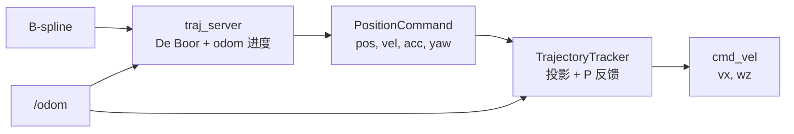

# 控制数学原理

本文说明 B 样条轨迹如何经 `traj_server` 采样为 `PositionCommand`，再由 `d1_planner_bridge` 转为差速底盘 `cmd_vel`。系统总览见 [00_overview.md](00_overview.md)。

---

## 1. 控制链路概览

EGO 原生输出四旋翼 **位置/速度/加速度 + 偏航** 高层指令。D1 为差速底盘，需要 **`linear.x`（前进）** 与 **`angular.z`（绕竖轴）**。

| 阶段 | 输入 | 输出 | 频率 |
|------|------|------|------|
| `traj_server` | B 样条 + odom | `pos_cmd` | 100 Hz |
| `d1_planner_bridge` | `pos_cmd` + odom | `/command/cmd_twist` | `control_rate_hz`（默认 100） |

消息定义：`src/quadrotor_msgs/msg/PositionCommand.msg`。D1 未使用 `kx`/`kv` 位置增益（`traj_server` 中置零）。

---

## 2. `traj_server`：轨迹采样与 yaw

源码：`src/planner/plan_manage/src/traj_server.cpp`。

### 2.1 B 样条重建与求导

收到 `traj_utils/Bspline` 后：

$$
\mathbf{p}(t) = \text{DeBoor}(\mathbf{Q}, t), \quad
\mathbf{v}(t) = \mathbf{p}'(t), \quad
\mathbf{a}(t) = \mathbf{p}''(t)
$$

实现为 `UniformBspline` 及其两次 `getDerivative()`。

### 2.2 时间参数：墙钟 vs 里程计进度

#### 模式 A：`use_odom_progress = false`（四旋翼默认）

$$
t_{\mathrm{cur}} = t_{\mathrm{now}} - t_{\mathrm{start}}
$$

#### 模式 B：`use_odom_progress = true`（D1 默认）

**Step 1 — 轨迹上最近点**（仅 XY）：

$$
t_{\mathrm{closest}} = \arg\min_{t \in [0, T]} \|\mathbf{p}^{xy}(t) - \mathbf{p}_{\mathrm{odom}}^{xy}\|^2
$$

实现为步长 $\Delta t = 0.05\,\text{s}$ 的穷举（`closestTimeOnTrajXY`）。

**Step 2 — 单调进度** $t_{\mathrm{progress}}$：

- 一般：$t_{\mathrm{progress}} \leftarrow \max(t_{\mathrm{progress}},\, t_{\mathrm{closest}})$（只前进）
- **过冲修正**：若 $t_{\mathrm{closest}} \approx T$ 且 odom 离终点仍远（$> \texttt{endpoint\_approach\_dist}$），允许 $t_{\mathrm{progress}} = t_{\mathrm{closest}}$ 回退

**Step 3 — 前瞻采样**：

$$
t_{\mathrm{cur}} = \min\bigl(t_{\mathrm{progress}} + \tau_{\mathrm{la}},\, T\bigr), \quad
\tau_{\mathrm{la}} = \texttt{odom\_lookahead\_time}
$$

D1 默认 $\tau_{\mathrm{la}} = 0.5\,\text{s}$。

**Step 4 — 终点 hold**（`endpoint_hold`）：

当 $t_{\mathrm{cur}} \ge T$ 且 $\|\mathbf{p}_{\mathrm{odom}}^{xy} - \mathbf{p}_{\mathrm{end}}^{xy}\| > \texttt{endpoint\_stop\_dist}$：

- `position` = 轨迹终点 $\mathbf{p}_{\mathrm{end}}$
- 速度指向终点：

$$
\mathbf{v} = \frac{\mathbf{p}_{\mathrm{end}}^{xy} - \mathbf{p}_{\mathrm{odom}}^{xy}}{\|\cdot\|} \cdot \min(v_{\max}^{\mathrm{end}},\; k_{\mathrm{end}} \cdot d_{xy})
$$

默认 $k_{\mathrm{end}}=0.8$，$v_{\max}^{\mathrm{end}}=1.6$。

这样慢车不会在“轨迹时间走完”后仍离终点较远时得到错误的高速采样。

### 2.3 发布量

在 $t_{\mathrm{cur}}$（或 hold 逻辑）采样：

$$
\texttt{cmd.position} = \mathbf{p}(t_{\mathrm{cur}}), \quad
\texttt{cmd.velocity} = \mathbf{v}(t_{\mathrm{cur}}), \quad
\texttt{cmd.acceleration} = \mathbf{a}(t_{\mathrm{cur}})
$$

**注意**：`cmd.position` 是轨迹上的 **前瞻跟踪点（carrot）**，不是机器人当前位置。桥接器横向误差即对比该点与 odom。

### 2.4 Yaw 与 `yaw_dot`

由空间前瞻方向确定期望偏航：

$$
\Delta \mathbf{p} = \mathbf{p}(t_{\mathrm{cur}} + \tau_{\mathrm{fwd}}) - \mathbf{p}(t_{\mathrm{cur}}), \quad
\psi_{\mathrm{des}} = \mathrm{atan2}(\Delta y,\, \Delta x)
$$

$\tau_{\mathrm{fwd}} =$ `time_forward`（D1 默认 0.7 s）。若 $\|\Delta \mathbf{p}\| < 0.1$，沿用 `last_yaw`。

角速度限幅：$|\dot\psi| \le \pi\,\text{rad/s}$，处理 $\pm\pi$ 跳变。

输出前低通：

$$
\psi \leftarrow 0.5\,\psi_{\mathrm{last}} + 0.5\,\psi_{\mathrm{des}}, \quad
\dot\psi \leftarrow 0.5\,\dot\psi_{\mathrm{last}} + 0.5\,\dot\psi_{\mathrm{des}}
$$

重规划时 $\psi$ 可能跳变 $\pm\pi$；桥接侧对 `yaw_dot` 前馈限幅缓解。

---

## 3. `d1_planner_bridge` 控制律

源码：`src/d1_planner_bridge/src/trajectory_tracker.cpp`。

仅当 `trajectory_flag == TRAJECTORY_STATUS_READY` 输出非零速度。

### 3.1 符号定义

| 符号 | 含义 |
|------|------|
| $\psi_r$ | 机器人 yaw（由 odom 四元数提取） |
| $\psi_p$ | 路径切向 yaw（由规划速度或 `cmd.yaw`） |
| $\mathbf{v}_w$ | 世界系规划速度 $(v_x^w, v_y^w)$ |
| $(x_r,y_r)$ | `cmd.position`（前瞻点） |
| $(x,y)$ | odom 位置 |

### 3.2 路径切向航向

$$
\psi_p = \begin{cases}
\mathrm{atan2}(v_y^w,\, v_x^w) & \|\mathbf{v}_w^{xy}\| > 0.05 \\
\texttt{cmd.yaw} & \text{otherwise}
\end{cases}
$$

### 3.3 有符号横向误差（cross-track）

路径切向单位向量 $\mathbf{u} = (\cos\psi_p,\, \sin\psi_p)$，位置误差 $\mathbf{e} = (x-x_r,\, y-y_r)$：

$$
e_{\mathrm{lat}} = u_y e_x - u_x e_y
$$

路径**左侧**为正（`signedLateralError`）。

### 3.4 航向误差

$$
e_\psi = \mathrm{wrap\_pi}(\psi_p - \psi_r) \in (-\pi,\pi]
$$

### 3.5 分支 A：大航向偏差 — 原地转向

若 $|e_\psi| > \theta_{\mathrm{align}}$（`align_heading_thresh_rad`，默认 0.6 rad ≈ 34°）：

$$
v_x = 0
$$

$$
\omega_z = \mathrm{clamp}(k_\psi\, e_\psi,\; -\omega_{\max},\; \omega_{\max})
$$

若 $|e_\psi| > 0.15$ 且 $|\omega_z| < \omega_{\min}^{\mathrm{turn}}$，则施加最小转向角速度 $\omega_{\min}^{\mathrm{turn}}$（`min_turn_wz`），避免“转不动”。

### 3.6 分支 B：已对准 — 前馈 + 反馈

#### 3.6.1 纵向速度前馈

世界系速度投影到车体前进方向：

$$
v_x = \cos\psi_r \cdot v_x^w + \sin\psi_r \cdot v_y^w
$$

（`project_velocity_to_body=true`）

禁止倒车（`allow_reverse=false`）：

$$
v_x \leftarrow \max(0,\, v_x)
$$

**最小前进速度**（克服静摩擦）：若 $v_{\mathrm{deadband}} < |v_x| < v_{\min}$，则抬升到 $v_{\min}$（`min_vx`，默认 0.08）。

#### 3.6.2 角速度：前馈 + 航向 P

$$
\omega_z = k_{\mathrm{ff}} \cdot \mathrm{clamp}(\dot\psi_{\mathrm{cmd}},\; \pm \dot\psi_{\mathrm{ff,max}})
$$

$$
\omega_z \mathrel{+}= \mathrm{clamp}(k_\psi\, e_\psi,\; -\omega_{\mathrm{yaw,p,max}},\; \omega_{\mathrm{yaw,p,max}})
$$

默认 $k_{\mathrm{ff}}=1.0$，$\dot\psi_{\mathrm{ff,max}}=0.5$，$k_\psi=1.2$。

#### 3.6.3 横向 P 纠偏

启用条件：`enable_lateral_correction` 且 $\|\mathbf{v}_w^{xy}\| \ge v_{\min}^{\mathrm{lat}}$ 且 $|e_{\mathrm{lat}}| \le e_{\max}^{\mathrm{lat}}$。

死区：

$$
e_{\mathrm{lat,eff}} = \begin{cases}
0 & |e_{\mathrm{lat}}| < \text{deadband} \\
e_{\mathrm{lat}} & \text{otherwise}
\end{cases}
$$

$$
\omega_z \mathrel{+}= \mathrm{clamp}(-k_{\mathrm{lat}}\, e_{\mathrm{lat,eff}},\; -\omega_{\mathrm{lat,p,max}},\; \omega_{\mathrm{lat,p,max}})
$$

负号含义：车在路径左侧（$e_{\mathrm{lat}}>0$）时需右转（$\omega_z<0$）回到路径。

#### 3.6.4 横向减速（可选）

$$
\text{scale} = 1 - g_{\mathrm{lat}} \cdot \min\left(\frac{|e_{\mathrm{lat}}|}{d_{\mathrm{slow}}},\, 1\right)
$$

$$
v_x \leftarrow v_x \cdot \max(0,\, \text{scale})
$$

默认 $g_{\mathrm{lat}}=0.25$，$d_{\mathrm{slow}}=0.4\,\text{m}$。

#### 3.6.5 限幅

$$
v_x \leftarrow \mathrm{clamp}(v_x,\, -v_{\max},\, v_{\max}), \quad
\omega_z \leftarrow \mathrm{clamp}(\omega_z,\, -\omega_{\max},\, \omega_{\max})
$$

D1 默认 $v_{\max}=1.6\,\text{m/s}$，$\omega_{\max}=1.0\,\text{rad/s}$（与规划 `max_vel` 对齐）。

### 3.7 输出 EMA 平滑

节点层（`d1_planner_bridge_node.cpp`）对发布前指令做一阶滤波：

$$
v_x^{\mathrm{out}} \leftarrow \alpha\, v_x + (1-\alpha)\, v_x^{\mathrm{out}}
$$

$$
\omega_z^{\mathrm{out}} \leftarrow \alpha\, \omega_z + (1-\alpha)\, \omega_z^{\mathrm{out}}
$$

$\alpha =$ `cmd_vel_ema_alpha`（默认 0.8），抑制重规划导致的 `cmd_vel` 跳变。

### 3.8 ROS 消息映射

$$
\texttt{Twist.linear.x} = v_x^{\mathrm{out}}, \quad
\texttt{Twist.angular.z} = \omega_z^{\mathrm{out}}
$$

其余分量为 0。

---

## 4. 闭环与坐标系约定

- 所有量均在 **世界系**（与 `/odom`、`/gazebo_obstacles` 一致）下规划与采样。
- Bridge 仅将 **速度** 从世界系投影到车体；位置误差使用世界系坐标差 + 路径切向角。
- `/odom` 同时驱动：FSM 状态、规划 z 锁定、traj 进度、底盘跟踪，形成 **三层闭环**（规划 2.5D / 轨迹时间 / 轮速）。

---

## 5. 参数表

### 5.1 `traj_server`（`single_run_d1.launch.py`）

| 参数 | 默认 | 含义 |
|------|------|------|
| `use_odom_progress` | true | 启用 odom 进度同步 |
| `odom_lookahead_time` | 0.5 | $\tau_{\mathrm{la}}$ |
| `time_forward` | 0.7 | yaw 空间前瞻 $\tau_{\mathrm{fwd}}$ |
| `endpoint_approach_dist` | 0.35 | 过末端仍“未到位”判定距离 |
| `endpoint_stop_dist` | 0.08 | 认为到达终点的 XY 距离 |
| `endpoint_vel_gain` | 0.8 | 终点引导 $k_{\mathrm{end}}$ |
| `endpoint_max_vel` | 1.6 | 终点引导速度上限 |

### 5.2 `d1_bridge.yaml`

| 参数 | 默认 | 含义 |
|------|------|------|
| `max_vx` | 1.6 | 前进速度上限 |
| `max_wz` | 1.0 | 角速度上限 |
| `yaw_kp` | 1.2 | 航向 P 增益 $k_\psi$ |
| `yaw_rate_ff` | 1.0 | $\dot\psi$ 前馈增益 $k_{\mathrm{ff}}$ |
| `max_yaw_dot_ff` | 0.5 | 前馈 $\dot\psi$ 限幅 |
| `max_wz_yaw_p` | 0.5 | 行驶中航向 P 项上限 |
| `align_heading_thresh_rad` | 0.6 | 原地转阈值 $\theta_{\mathrm{align}}$ |
| `min_turn_wz` | 0.5 | 原地转最小 $\omega$ |
| `lateral_kp` | 0.3 | 横向增益 $k_{\mathrm{lat}}$ |
| `lateral_error_deadband` | 0.05 | 横向死区 |
| `max_wz_lateral_p` | 0.35 | 横向 P 项上限 |
| `min_plan_speed_for_lateral` | 0.15 | 规划速度过低不做横向 |
| `max_lateral_error_m` | 2.0 | 横向失效距离 |
| `vx_lat_damp_gain` | 0.25 | 横向减速 $g_{\mathrm{lat}}$ |
| `lateral_slowdown_dist` | 0.4 | 减速归一化距离 |
| `min_vx` | 0.08 | 最小前进速度 |
| `cmd_vel_ema_alpha` | 0.8 | 输出 EMA 系数 $\alpha$ |
| `allow_reverse` | false | 禁止倒车 |
| `project_velocity_to_body` | true | 世界→车体速度投影 |

### 5.3 与规划参数的耦合

| 规划 | 控制 | 建议 |
|------|------|------|
| `max_vel` | `max_vx`, `endpoint_max_vel` | 保持一致，避免规划速度被截断或饱和 |
| `thresh_replan_time` | — | 过小会导致周期性减速重规划 |
| `goal_reach_thresh` | `endpoint_stop_dist` | 到达判定分别用于 FSM 与 traj hold，数量级应协调 |

---

## 6. 调参思路（简要）

1. **跟不紧轨迹**：增大 `odom_lookahead_time`；检查 `max_vx` 是否与规划一致。
2. **车头摇摆**：降低 `yaw_kp`、`max_yaw_dot_ff`；增大 `cmd_vel_ema_alpha` 更平滑但滞后更大。
3. **走 S 形**：增大 `lateral_kp` 或减小 `max_wz_lateral_p`；检查 `cmd.position` 前瞻是否合理。
4. **到终点冲过头**：减小 `endpoint_vel_gain` 或增大 `endpoint_stop_dist`；规划侧检查 XY `goal_reach_thresh`。
5. **重规划顿挫**：增大 `thresh_replan_time`；EMA $\alpha$ 略降（更平滑）或略升（更跟手）需实机权衡。

---

## 7. 关键源码

| 内容 | 文件 |
|------|------|
| 轨迹采样 | `src/planner/plan_manage/src/traj_server.cpp` |
| 跟踪律 | `src/d1_planner_bridge/src/trajectory_tracker.cpp` |
| 节点与 EMA | `src/d1_planner_bridge/src/d1_planner_bridge_node.cpp` |
| 参数 | `src/d1_planner_bridge/config/d1_bridge.yaml` |
