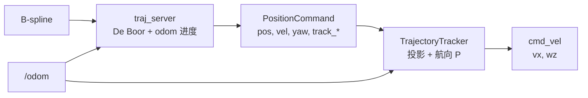

# 控制数学原理

本文说明 B 样条轨迹如何经 `traj_server` 采样为 `PositionCommand`，再由 `d1_planner_bridge` 转为差速底盘 `cmd_vel`。系统总览见 [00_overview.md](00_overview.md)。

---

## 1. 控制链路概览

规划输出为 **位置 / 速度 / 加速度 + 偏航** 高层指令。D1 为差速底盘，需要 **`linear.x`（前进）** 与 **`angular.z`（绕竖轴）**。

```mermaid
flowchart LR
    BS["B-spline"] --> TS["traj_server\nDe Boor + odom 进度"]
    TS --> PC["PositionCommand\npos, vel, yaw, track_*"]
    PC --> BR["TrajectoryTracker\n投影 + 航向 P"]
    BR --> CV["cmd_vel\nvx, wz"]
    Odom["/odom"] --> TS
    Odom --> BR
```

| 阶段 | 输入 | 输出 | 频率 |
|------|------|------|------|
| `traj_server` | B 样条 + odom | `pos_cmd` | 100 Hz |
| `d1_planner_bridge` | `pos_cmd` + odom | `/command/cmd_twist` | `control_rate_hz`（默认 100） |

消息：`src/quadrotor_msgs/msg/PositionCommand.msg`。D1 未使用 `kx`/`kv`（置零）。

---

## 2. `traj_server`：轨迹采样与 yaw

源码：`src/planner/plan_manage/src/traj_server.cpp`。

### 2.1 B 样条重建与求导

$$
\mathbf{p}(t) = \text{DeBoor}(\mathbf{Q}, t), \quad
\mathbf{v}(t) = \mathbf{p}'(t), \quad
\mathbf{a}(t) = \mathbf{p}''(t)
$$

### 2.2 时间参数：墙钟 vs 里程计进度

#### 模式 A：`use_odom_progress = false`

$$
t_{\mathrm{cur}} = t_{\mathrm{now}} - t_{\mathrm{start}}
$$

#### 模式 B：`use_odom_progress = true`（D1 默认）

**Step 1 — 轨迹上最近点**（仅 XY，$\Delta t = 0.05\,\text{s}$ 穷举）：

$$
t_{\mathrm{closest}} = \arg\min_{t \in [0, T]} \|\mathbf{p}^{xy}(t) - \mathbf{p}_{\mathrm{odom}}^{xy}\|^2
$$

**Step 2 — 单调进度** $t_{\mathrm{progress}}$：

- 一般：$t_{\mathrm{progress}} \leftarrow \max(t_{\mathrm{progress}},\, t_{\mathrm{closest}})$
- 若 $t_{\mathrm{closest}} \approx T$，允许直接对齐到末端

**Step 3 — 前瞻采样**：

$$
t_{\mathrm{cur}} = \min\bigl(t_{\mathrm{progress}} + \tau_{\mathrm{la}},\, T\bigr), \quad
\tau_{\mathrm{la}} = \texttt{odom\_lookahead\_time}
$$

默认 $\tau_{\mathrm{la}} = 0.5\,\text{s}$（`d1_robot.yaml` → `traj_server`）。

**Step 4 — 终点零速**：

当 $\|\mathbf{p}_{\mathrm{odom}}^{xy} - \mathbf{p}_{\mathrm{end}}^{xy}\| \le \texttt{endpoint\_stop\_dist}$（默认与 `goal_reach_thresh` 同为 **0.3 m**）：

- `position` = 轨迹终点，$\mathbf{v}=\mathbf{0}$，$\mathbf{a}=\mathbf{0}$

### 2.3 发布量

$$
\texttt{cmd.position} = \mathbf{p}(t_{\mathrm{cur}}), \quad
\texttt{cmd.velocity} = \mathbf{v}(t_{\mathrm{cur}}), \quad
\texttt{cmd.acceleration} = \mathbf{a}(t_{\mathrm{cur}})
$$

另填：

- `track_point` / `track_yaw`：基于 $t_{\mathrm{closest}}$（或墙钟 $t_{\mathrm{cur}}$）的最近点与切向，供调试与桥接兜底航向

`cmd.position` 是前瞻跟踪点（carrot），不是机器人当前位置。

### 2.4 Yaw 与 `yaw_dot`

当前实现：若 $\|\mathbf{v}^{xy}\| > 0.05$，则

$$
\psi = \mathrm{atan2}(v_y, v_x), \quad
\dot\psi = \mathrm{clamp}\bigl(\mathrm{wrap\_pi}(\psi - \psi_{\mathrm{last}})/\Delta t,\; \pm \dot\psi_{\max}\bigr)
$$

$\dot\psi_{\max} =$ `max_yaw_dot`（= `limits.max_wz`，默认 0.5）。低速时保持 `last_yaw`。  
（空间前瞻 `time_forward` 仍用于新轨迹到达时初始化 `last_yaw`。）

---

## 3. `d1_planner_bridge` 控制律

源码：`trajectory_tracker.cpp`、`d1_planner_bridge_node.cpp`。

仅当 `trajectory_flag == TRAJECTORY_STATUS_READY` 输出非零速度。

### 3.1 符号定义

| 符号 | 含义 |
|------|------|
| $\psi_r$ | 车体前进方向 yaw：odom 四元数下 body **+Z** 轴在水平面投影（与 OpenVINS 相机光轴约定一致） |
| $\psi_p$ | 路径切向：$\|\mathbf{v}^{xy}\|>0.05$ 时用规划速度，否则 `cmd.yaw` / `cmd.track_yaw` |
| $\mathbf{v}_w$ | 世界系规划速度 |

### 3.2 纵向速度

$$
v_x = \mathbf{u}_r \cdot \mathbf{v}_w^{xy}
$$

（`project_velocity_to_body=true`；$\mathbf{u}_r$ 为 body +Z 水平单位向量）

禁止倒车：`vx ← max(0, vx)`。

### 3.3 航向误差与角速度

$$
e_\psi = \mathrm{wrap\_pi}(\psi_p - \psi_r)
$$

$$
\omega_z = k_{\mathrm{ff}} \cdot \dot\psi_{\mathrm{cmd}} + k_\psi\, e_\psi
$$

默认 $k_{\mathrm{ff}}=1.0$，$k_\psi=1.2$。

### 3.4 大航向偏差 — 原地转向

若 $|e_\psi| > \theta_{\mathrm{align}}$（`align_heading_thresh_rad`，默认 **0.4** rad）：

$$
v_x = 0, \quad \omega_z = k_\psi\, e_\psi
$$

若 $|e_\psi| > 0.15$ 且 $|\omega_z| < \omega_{\min}^{\mathrm{turn}}$，抬升到 `min_turn_wz`（默认 **0.15**）。

### 3.5 限幅

$$
v_x \leftarrow \mathrm{clamp}(v_x,\, \pm v_{\max}), \quad
\omega_z \leftarrow \mathrm{clamp}(\omega_z,\, \pm \omega_{\max})
$$

$v_{\max}=0.6$，$\omega_{\max}=0.5$（`d1_robot.yaml` → launch 注入）。

### 3.6 看门狗（节点层）

| 条件 | 行为 |
|------|------|
| 尚无 `pos_cmd` | 发布零速 |
| `cmd_age > cmd_timeout_sec`（默认 0.3 s） | 强制零速，`[watchdog]` |
| 需要 odom 且 `odom_age > odom_timeout_sec`（默认 0.5 s） | 强制零速 |

### 3.7 已移除 / 不再存在的项

相对旧文档，当前桥接 **没有**：横向 CTE P 纠偏、`min_vx`、输出 EMA、`hard_stop_plan_speed`。停车依赖规划侧停车样条 + traj_server 终点零速 + 看门狗。

### 3.8 ROS 消息映射

$$
\texttt{Twist.linear.x} = v_x, \quad
\texttt{Twist.angular.z} = \omega_z
$$

---

## 4. 闭环与坐标系约定

- 规划与采样在 **global** 系（与 VIO、建图一致）。
- Bridge 将速度投影到车体前进方向；航向用 body +Z 水平投影，**不是** 常规 IMU yaw（body +X）。
- VIO 同时驱动：FSM、规划 $z$、traj 进度、底盘跟踪。

---

## 5. 参数表

### 5.1 `traj_server`（来自 `d1_robot.yaml`）

| 参数 | 默认 | 含义 |
|------|------|------|
| `use_odom_progress` | true | odom 进度同步 |
| `odom_lookahead_time` | 0.5 | $\tau_{\mathrm{la}}$ |
| `time_forward` | 0.7 | 新轨迹 yaw 初始化前瞻 |
| `endpoint_stop_dist` | 0.3 | 距终点 XY 内速度清零（= `goal_reach_thresh`） |
| `max_yaw_dot` | 0.5 | yaw 角速度上限（= `max_wz`） |

### 5.2 `d1_bridge.yaml`

| 参数 | 默认 | 含义 |
|------|------|------|
| `max_vx` / `max_wz` | 0.6 / 0.5 | launch 注入限速 |
| `yaw_kp` | 1.2 | 航向 P |
| `yaw_rate_ff` | 1.0 | $\dot\psi$ 前馈 |
| `align_heading_thresh_rad` | 0.4 | 原地转阈值 |
| `min_turn_wz` | 0.15 | 原地转最小角速度 |
| `cmd_timeout_sec` | 0.3 | pos_cmd 看门狗 |
| `odom_timeout_sec` | 0.5 | odom 看门狗 |
| `allow_reverse` | false | 禁止倒车 |
| `project_velocity_to_body` | true | 世界→车体投影 |

### 5.3 与规划参数的耦合

| 规划 | 控制 | 建议 |
|------|------|------|
| `max_vel` | `max_vx` | 保持一致 |
| `thresh_replan_time` | — | 过小 → 周期性减速重规划 |
| `goal_reach_thresh` | `endpoint_stop_dist` | 已由配置对齐为同值 |

---

## 6. 调参思路（简要）

1. **跟不紧**：增大 `odom_lookahead_time`；核对 `max_vx`。
2. **车头摇摆 / 只转不走**：降低 `yaw_kp`；略增 `align_heading_thresh_rad`；检查 `min_turn_wz`。
3. **到终点不停**：查 FSM `goal_reach_thresh` 与 traj `endpoint_stop_dist`。
4. **突然零速**：看 `[watchdog]` 是否超时；查 VIO / pos_cmd 频率。

---

## 7. 关键源码

| 内容 | 文件 |
|------|------|
| 轨迹采样 | `src/planner/plan_manage/src/traj_server.cpp` |
| 跟踪律 | `src/d1_planner_bridge/src/trajectory_tracker.cpp` |
| 节点与看门狗 | `src/d1_planner_bridge/src/d1_planner_bridge_node.cpp` |
| 参数 | `src/d1_planner_bridge/config/d1_bridge.yaml`，`d1_robot.yaml` |
