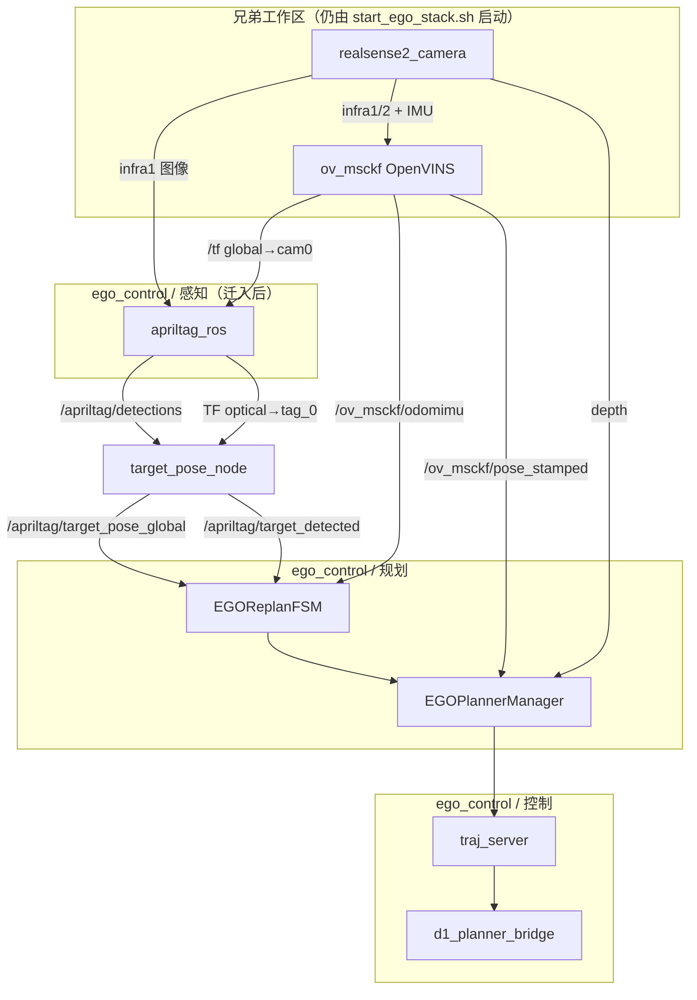

# AprilTag 感知接入 ego_control

本文说明如何把 **AprilTag 检测 + 世界系目标位姿** 并入 `ego_control` 工程，与现有的 **规划（ego_planner）**、**控制（d1_planner_bridge）** 形成统一工作区，而不再依赖独立的 `apriltagdetect` 工作区。

规划侧如何消费目标话题，见根目录 [APRILTAG_TRACKING_INTEGRATION.md](../APRILTAG_TRACKING_INTEGRATION.md)（FSM 状态机、跟随偏移、重规划节流等）。本文侧重 **感知层怎么迁、怎么接、怎么一键启动**。

---

## 1. ego_control 现有结构

`ego_control` 是一个 ROS 2 colcon 工作区，当前源码在 `src/` 下分为 **规划** 与 **控制** 两大块；感知（相机、VIO）由同目录兄弟工程提供，经 `start_ego_stack.sh` 统一拉起。

```
ego_control/
├── start_ego_stack.sh              # 一键启动脚本
├── APRILTAG_TRACKING_INTEGRATION.md  # 规划侧 Tag 跟随（已实现）
├── docs/
│   ├── 00_overview.md              # 感知 → 规划 → 控制 总览
│   ├── 01_planning_math.md
│   ├── 02_control_math.md
│   └── 04_apriltag_integration.md  # 本文
└── src/
    ├── planner/                    # 规划栈
    │   ├── plan_manage/            # FSM、ego_planner_node、traj_server、launch
    │   ├── plan_env/               # GridMap 深度建图
    │   ├── bspline_opt/
    │   ├── path_searching/
    │   └── traj_utils/
    ├── d1_planner_bridge/          # 控制栈：pos_cmd → cmd_vel
    └── quadrotor_msgs/
```

### 三层职责

| 层级 | 所在位置 | 职责 | 默认由谁启动 |
|------|----------|------|--------------|
| **感知** | `../realsense`、`../openvins`；**待迁入** AprilTag | 图像、IMU、VIO 位姿、Tag 世界坐标 | `start_ego_stack.sh` 前两步 |
| **规划** | `src/planner/` | 避障、B 样条、Tag 跟随 FSM | `start_ego_stack.sh` 第三步 |
| **控制** | `src/d1_planner_bridge/` | 差速跟踪、发 `cmd_vel` | `start_ego_stack.sh` 第四步 |

当前缺口：**感知层里的 AprilTag 仍在独立仓库 `../apriltagdetect`**，需要手动第二个终端 `apriltag_only.launch.py`。目标是把这一块收进 `ego_control/src/`。

---

## 2. 独立 apriltagdetect 里有什么

`../apriltagdetect` 工作区只有一个 Python 包 `apriltag_detect`，逻辑很轻，适合原样迁入：

| 文件 | 作用 |
|------|------|
| `apriltag_detect/target_pose_node.py` | 查 TF，计算 Tag 在 `global` 系位姿 |
| `config/tags.yaml` | `apriltag_ros` 参数（族、ID、物理尺寸） |
| `config/target_pose.yaml` | `target_pose_node` 坐标系与话题名 |
| `launch/apriltag_only.launch.py` | 只起 `apriltag_ros` + `target_pose_node` |

**不需要迁入** `launch/d435i_apriltag.launch.py`：它会重复启动 RealSense + OpenVINS，且 infra 帧率（90Hz）与 ego 脚本（30Hz）不一致，容易导致 VIO 抖动。实机统一用 `start_ego_stack.sh` 起底座 + 本仓内的 `apriltag_only` 起检测即可。

系统依赖（apt）：

```bash
sudo apt install ros-humble-apriltag-ros ros-humble-apriltag-msgs
```

---

## 3. 迁入后的目标目录

建议在 `ego_control/src/` 下新增 **感知** 子目录，与 `planner/`、`d1_planner_bridge/` 并列：

```
ego_control/src/
├── perception/
│   └── apriltag_detect/          # 从 apriltagdetect 迁入
│       ├── package.xml
│       ├── setup.py
│       ├── resource/
│       ├── apriltag_detect/
│       │   └── target_pose_node.py
│       ├── config/
│       │   ├── tags.yaml
│       │   └── target_pose.yaml
│       └── launch/
│           └── apriltag.launch.py   # 由原 apriltag_only.launch.py 改名
├── planner/
└── d1_planner_bridge/
```

包名保持 `apriltag_detect` 不变，这样 `ego_replan_fsm` 里写死的话题名、`start_ego_stack.sh` 参数都无需修改。

---

## 4. 端到端数据流（接入后）



### 感知 → 规划 话题契约（已实现，勿改）

| 话题 | 类型 | 生产者 | 消费者 |
|------|------|--------|--------|
| `/apriltag/target_pose_global` | `geometry_msgs/PoseStamped` | `target_pose_node` | `EGOReplanFSM`（`enable_tag_tracking=true`） |
| `/apriltag/target_detected` | `std_msgs/Bool` | `target_pose_node` | `EGOReplanFSM` |

约束：

- `target_pose_global.header.frame_id` 必须为 **`global`**（与 OpenVINS 世界系一致）。
- 以 **`target_detected`** 为准判断有无目标；pose 回调只缓存，检测到后再用最新 pose。
- 规划 **仅用 position**；`orientation` 预留。

### target_pose 计算公式

```
T_global_tag = T_global_cam0 × T_cam0_optical × T_optical_tag
```

| 变换 | 来源 |
|------|------|
| `T_optical_tag` | `apriltag_ros` 发布 TF（`camera_infra1_optical_frame` → `tag_0`） |
| `T_global_cam0` | OpenVINS `/tf`（`global` → `cam0`） |
| `T_cam0_optical` | 两棵 TF 树无直连时近似为单位阵（见 `target_pose_node.py`） |

---

## 5. 迁移步骤（操作清单）

### 5.1 拷贝源码

```bash
D1ROBOT=/media/robot/fbef3ee2-7772-4270-bb96-3341057c7bc1/d1robot
mkdir -p ${D1ROBOT}/ego_control/src/perception

cp -a ${D1ROBOT}/apriltagdetect/src/apriltag_detect \
      ${D1ROBOT}/ego_control/src/perception/

# 可选：删除迁入包内不需要的一键 launch
rm -f ${D1ROBOT}/ego_control/src/perception/apriltag_detect/launch/d435i_apriltag.launch.py

# 建议改名，语义更清晰
mv ${D1ROBOT}/ego_control/src/perception/apriltag_detect/launch/apriltag_only.launch.py \
   ${D1ROBOT}/ego_control/src/perception/apriltag_detect/launch/apriltag.launch.py
```

### 5.2 编译 ego_control

```bash
cd ${D1ROBOT}/ego_control
source /opt/ros/humble/setup.bash
source ${D1ROBOT}/realsense/install/setup.bash   # 若脚本里会起相机
source ${D1ROBOT}/openvins/install/setup.bash
colcon build --symlink-install --packages-select apriltag_detect
source install/setup.bash
```

确认：

```bash
ros2 pkg list | grep apriltag_detect
ros2 pkg prefix apriltag_detect
```

### 5.3 修改 `start_ego_stack.sh`

在 **OpenVINS 就绪之后、EGO 规划之前**（或之后、RViz 之前）增加 AprilTag 启动块；仅在 `enable_tag_tracking=true` 时拉起：

```bash
# 在 OpenVINS wait 之后、EGO 规划之前插入示例：

if [[ "${ENABLE_TAG_TRACKING}" == "true" ]]; then
  launch_bg apriltag \
    ros2 launch apriltag_detect apriltag.launch.py
  if [[ "${SKIP_WAIT}" == "false" ]]; then
    wait_for_topic /apriltag/target_detected 30 || true
  fi
fi
```

要点：

- **不要** 在脚本里 source `apriltagdetect/install/setup.bash`；检测包已编进 `ego_control`。
- 保持 RealSense 用默认 `rs_launch.py`（infra **30Hz**），勿改 90Hz。
- 启动顺序：相机 → VIO 稳定 → AprilTag → 规划 → 桥接。

### 5.4 配置 Tag 物理尺寸

编辑 `src/perception/apriltag_detect/config/tags.yaml`，**`size` 与 `tag.sizes` 必须一致**，填黑色方块实测边长（米）：

```yaml
size: 0.0778
tag:
  ids: [0]
  frames: [tag_0]
  sizes: [0.0778]    # 勿与 size 不一致
```

### 5.5 废弃独立工作区（可选）

迁入并验证通过后：

- 日常不再 `source apriltagdetect/install/setup.bash`
- `../apriltagdetect` 可归档或删除，避免同事误用旧路径

---

## 6. 启动方式（迁入完成后）

### 6.1 手动设点（默认）

```bash
cd ego_control
./start_ego_stack.sh
# RViz Fixed Frame = global，2D Goal 设点
```

### 6.2 AprilTag 跟随

```bash
./start_ego_stack.sh enable_tag_tracking=true
# 脚本自动起 apriltag_ros + target_pose_node
# Tag 进入视野后 FSM 自动规划跟随点 G = T + offset
```

### 6.3 分步调试（与一键等价）

```bash
# 终端 1
./start_ego_stack.sh --no-rviz enable_tag_tracking=false

# 终端 2（仅调试感知）
source ego_control/install/setup.bash
ros2 launch apriltag_detect apriltag.launch.py
```

---

## 7. 与规划 / 控制模块的边界

| 模块 | 是否需要改代码 | 说明 |
|------|----------------|------|
| `apriltag_detect`（迁入） | 迁包即可 | 发布两个标准话题 |
| `EGOReplanFSM` | **已实现** | `enable_tag_tracking`、偏移、丢失逻辑见 [APRILTAG_TRACKING_INTEGRATION.md](../APRILTAG_TRACKING_INTEGRATION.md) |
| `d1_planner_bridge` | **不改** | 仍跟 `pos_cmd`，不感知 Tag |
| `GridMap` | **不改** | 仍用 depth + VIO pose 建图 |
| `traj_server` | **不改** | 仍采样 B 样条 |

感知与规划之间 **只通过 ROS 话题耦合**，不引入编译依赖。这是推荐做法：以后换检测实现，只要仍发布同名话题，规划层不用动。

---

## 8. 验证清单

```bash
# 1. 检测
ros2 topic echo /apriltag/detections --once

# 2. Tag TF
ros2 run tf2_ros tf2_echo camera_infra1_optical_frame tag_0

# 3. VIO
ros2 run tf2_ros tf2_echo global cam0

# 4. 目标位姿
ros2 topic echo /apriltag/target_pose_global
ros2 topic echo /apriltag/target_detected

# 5. 规划是否收到（追踪模式）
ros2 topic echo /drone_0_plan_vis/goal_point   # 应随 Tag 更新跟随点 G
```

`target_pose_node` 在 TF 失败时每 5 秒打一条 warning，日志在 `ego_log/stack_*/apriltag.log`。

---

## 9. 常见问题

| 现象 | 原因 | 处理 |
|------|------|------|
| `target_detected` 一直 false | VIO 未初始化 | 等 `/ov_msckf/pose_stamped` 稳定，轻微晃动相机 |
| VIO path 抖动 | 误用 `d435i_apriltag` 或 infra 90Hz | 只用 `start_ego_stack.sh` + 本仓 `apriltag.launch.py` |
| 距离明显不对 | `tags.yaml` 尺寸错误 | 尺子复核黑色边长，统一 `size` / `tag.sizes` |
| 规划不跟 Tag | 未开 `enable_tag_tracking=true` | 重启脚本并带参数 |
| 包找不到 | 未编 ego_control | `colcon build --packages-select apriltag_detect` |

---

## 10. 文档索引

| 文档 | 内容 |
|------|------|
| [00_overview.md](00_overview.md) | 感知 → 规划 → 控制总览 |
| **04_apriltag_integration.md（本文）** | AprilTag 感知迁入 ego_control、数据流、迁移步骤 |
| [APRILTAG_TRACKING_INTEGRATION.md](../APRILTAG_TRACKING_INTEGRATION.md) | 规划 FSM 如何跟随 Tag、参数表 |
| `../apriltagdetect/README.md` | 原独立工作区说明（迁入后可作参考） |

---

**版本：** v1.0 · **状态：** 接入说明（感知包待按 §5 迁入 `src/perception/`）
