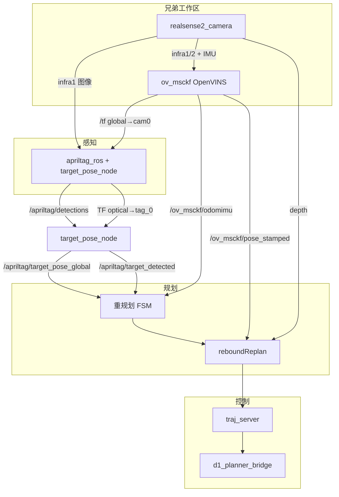

# AprilTag 感知接入 ego_control

本文说明 **AprilTag 检测 + 世界系目标位姿** 在本工程中的位置，与 **规划栈**、**控制（`d1_planner_bridge`）** 的对接方式。

规划侧如何消费目标话题，见 [APRILTAG_TRACKING_INTEGRATION.md](../APRILTAG_TRACKING_INTEGRATION.md)。本文侧重 **感知包结构、话题契约、一键启动**。

> **状态：** `apriltag_detect` 已迁入 `src/perception/apriltag_detect/`，由 `start_ego_stack.sh enable_tag_tracking=true` 拉起。§5 为历史迁移记录。

---

## 1. 现有结构

```
ego_control/
├── start_ego_stack.sh
├── APRILTAG_TRACKING_INTEGRATION.md
├── docs/
└── src/
    ├── planner/                    # 规划栈
    │   ├── plan_manage/            # FSM、traj_server、launch、d1_robot.yaml
    │   ├── plan_env/
    │   ├── bspline_opt/
    │   ├── path_searching/
    │   └── traj_utils/
    ├── d1_planner_bridge/
    ├── perception/apriltag_detect/
    └── quadrotor_msgs/
```

| 层级 | 所在位置 | 职责 |
|------|----------|------|
| **感知** | `../realsense`、`../openvins`；`src/perception/apriltag_detect/` | 图像、IMU、VIO、Tag 世界坐标 |
| **规划** | `src/planner/` | 避障、B 样条、Tag 跟随 FSM |
| **控制** | `src/d1_planner_bridge/` | 差速跟踪、发 `cmd_vel` |

---

## 2. apriltag_detect 包内容

| 文件 | 作用 |
|------|------|
| `apriltag_detect/target_pose_node.py` | 查 TF，计算 Tag 在 `global` 系位姿 |
| `config/tags.yaml` | 族、ID、物理尺寸 |
| `config/target_pose.yaml` | 坐标系与话题名 |
| `launch/apriltag.launch.py` | 起 `apriltag_ros` + `target_pose_node` |

**不要**使用会重复起 RealSense + OpenVINS 的一键 launch（infra 90Hz 易导致 VIO 抖动）。实机统一用 `start_ego_stack.sh`。

```bash
sudo apt install ros-humble-apriltag-ros ros-humble-apriltag-msgs
```

---

## 3. 端到端数据流


```mermaid
flowchart TB
  subgraph ext["兄弟工作区"]
    RS["realsense2_camera"]
    OV["ov_msckf OpenVINS"]
  end

  subgraph ego_perception["感知"]
    AT["apriltag_ros + target_pose_node"]
  end

  subgraph ego_plan["规划"]
    FSM["重规划 FSM"]
    PM["reboundReplan"]
  end

  subgraph ego_ctrl["控制"]
    TS["traj_server"]
    BR["d1_planner_bridge"]
  end

  RS -->|infra1 图像| AT
  RS -->|infra1/2 + IMU| OV
  OV -->|/tf global→cam0| AT
  AT -->|/apriltag/detections| TP["target_pose_node"]
  AT -->|TF optical→tag_0| TP
  TP -->|/apriltag/target_pose_global| FSM
  TP -->|/apriltag/target_detected| FSM

  OV -->|/ov_msckf/odomimu| FSM
  OV -->|/ov_msckf/pose_stamped| PM
  RS -->|depth| PM
  FSM --> PM
  PM --> TS --> BR
```

### 感知 → 规划 话题契约

| 话题 | 类型 | 生产者 | 消费者 |
|------|------|--------|--------|
| `/apriltag/target_pose_global` | `PoseStamped` | `target_pose_node` | FSM（`enable_tag_tracking=true`） |
| `/apriltag/target_detected` | `Bool` | `target_pose_node` | FSM |

- `frame_id` 须为 **`global`**
- 以 **`target_detected`** 为准；pose 只缓存
- 规划 **仅用 position**

```
T_global_tag = T_global_cam0 × T_cam0_optical × T_optical_tag
```

---

## 4. 历史：从独立工作区迁入（已完成）

日常开发无需重复。要点：拷贝至 `src/perception/apriltag_detect/`、`colcon build --packages-select apriltag_detect`、`start_ego_stack.sh` 在 OpenVINS 之后按需拉起、配置 `tags.yaml` 尺寸一致。

---

## 5. 启动方式

```bash
./start_ego_stack.sh                         # 手动 2D Goal
./start_ego_stack.sh enable_tag_tracking=true # Tag 跟随
```

---

## 6. 模块边界

| 模块 | 是否改代码 | 说明 |
|------|------------|------|
| `apriltag_detect` | 迁包即可 | 发布两话题 |
| 重规划 FSM | **已实现** | 见 APRILTAG 文档 |
| `d1_planner_bridge` | **不改** | 仍跟 `pos_cmd` |
| `GridMap` / `traj_server` | **不改** | |

感知与规划 **只通过 ROS 话题耦合**。

---

## 7. 验证清单

```bash
ros2 topic echo /apriltag/detections --once
ros2 run tf2_ros tf2_echo camera_infra1_optical_frame tag_0
ros2 run tf2_ros tf2_echo global cam0
ros2 topic echo /apriltag/target_pose_global
ros2 topic echo /apriltag/target_detected
ros2 topic echo /drone_0_plan_vis/goal_point
```

日志：`ego_log/stack_*/apriltag.log`。

---

## 8. 常见问题

| 现象 | 处理 |
|------|------|
| `target_detected` 一直 false | 等 VIO 稳定 |
| VIO 抖动 | 勿用 90Hz infra 一键包 |
| 距离不对 | 复核 `tags.yaml` 边长 |
| 规划不跟 Tag | 确认 `enable_tag_tracking=true` |

---

## 9. 文档索引

| 文档 | 内容 |
|------|------|
| [00_overview.md](00_overview.md) | 总览 |
| **本文** | AprilTag 感知接入 |
| [APRILTAG_TRACKING_INTEGRATION.md](../APRILTAG_TRACKING_INTEGRATION.md) | Tag 跟随 FSM |

**版本：** v1.1 · **状态：** 感知包已迁入 `src/perception/`
