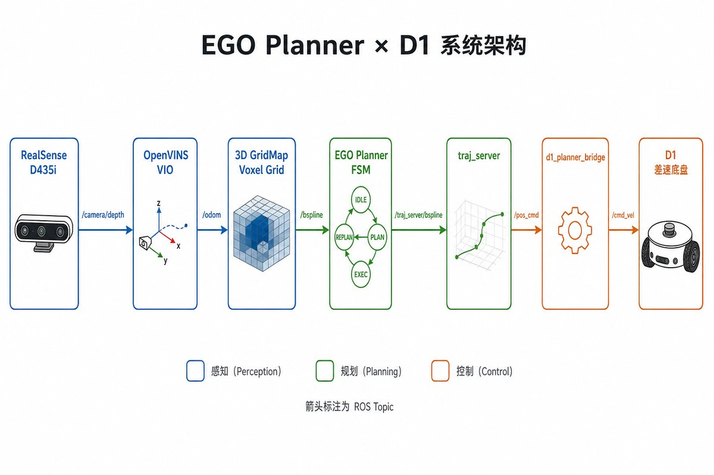
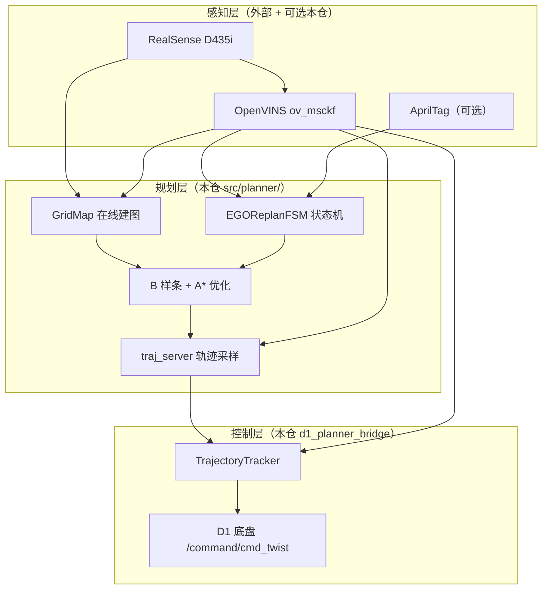
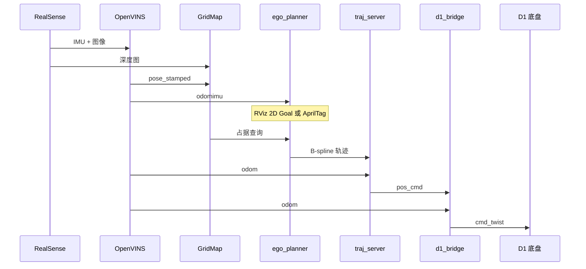
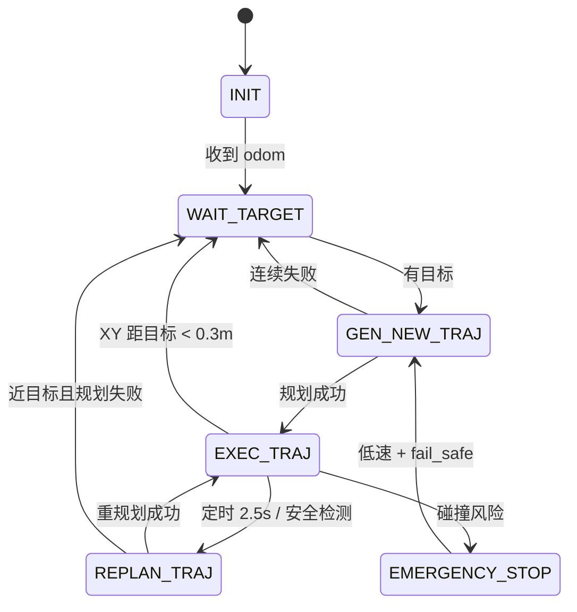
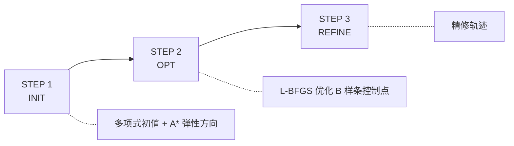
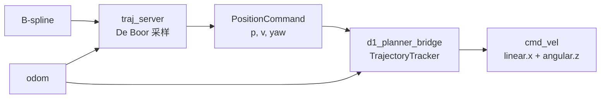
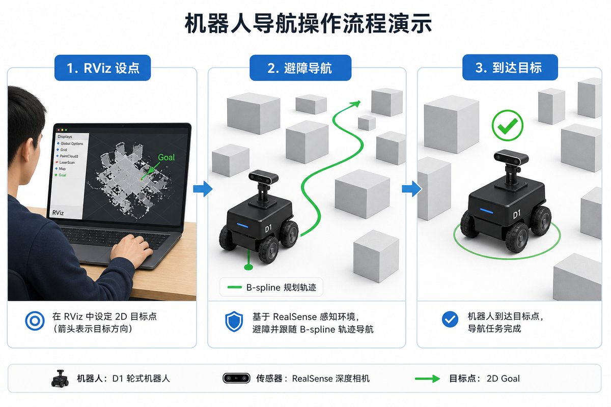

# EGO Planner × D1 实机 Demo 指南

> 本文面向首次接触本项目的开发者与演示人员，介绍 **项目架构**、**运行流程** 与 **关键技术点**。  
> 编译、依赖与参数详见 [Readme.md](../Readme.md)；数学细节见 [系统总览](00_overview.md)、[规划原理](01_planning_math.md)、[控制原理](02_control_math.md)。

---

## 1. 项目是什么？

**ego_control** 是一个 ROS 2 Humble 工作区，将 **EGO Planner**（原为四旋翼 3D 避障规划器）适配到 **D1 地面差速机器人** 实机部署。

| 能力 | 说明 |
|------|------|
| 在线感知建图 | RealSense D435i 深度 + OpenVINS VIO → 3D 体素占据栅格 |
| 实时避障规划 | 固定高度 XY 平面 B 样条轨迹 + FSM 重规划 |
| 底盘执行 | `traj_server` 采样 → `d1_planner_bridge` 转 `cmd_vel` |
| 可选 AprilTag 跟随 | 检测 Tag 后自动导航至目标距离 |

**一句话概括**：相机看路、VIO 定位、EGO 规划避障路径、桥接节点驱动 D1 底盘。

---

## 2. 系统架构

<p align="center">
  
</p>

### 2.1 三层结构



### 2.2 仓库目录结构

```
ego_control/
├── start_ego_stack.sh          # 一键启动（实机推荐）
├── Readme.md                   # 快速上手
├── docs/                       # 文档（含本文）
└── src/
    ├── planner/                # 规划栈（C++）
    │   ├── plan_manage/        # FSM、节点、launch、配置
    │   ├── plan_env/           # GridMap 深度建图
    │   ├── bspline_opt/        # B 样条 L-BFGS 优化
    │   ├── path_searching/     # 动态 A*
    │   └── traj_utils/         # 轨迹消息与工具
    ├── d1_planner_bridge/      # D1 底盘控制桥接
    ├── perception/apriltag_detect/  # AprilTag 位姿发布
    └── quadrotor_msgs/         # PositionCommand 等自定义消息
```

### 2.3 兄弟工作区依赖

本仓不单独包含相机驱动与 VIO，需与同级目录协同编译：

```
d1robot/
├── realsense/     # realsense2_camera
├── openvins/      # ov_msckf
└── ego_control/   # 本仓库
```

---

## 3. 数据流与话题

### 3.1 端到端数据流



### 3.2 关键 ROS 话题

| 话题 | 类型 | 方向 | 说明 |
|------|------|------|------|
| `/ov_msckf/odomimu` | Odometry | VIO → 规划/控制 | 全局系位姿与速度 |
| `/ov_msckf/pose_stamped` | PoseStamped | VIO → GridMap | 深度投影建图 |
| `/camera/camera/depth/image_rect_raw` | Image | RealSense → GridMap | 16UC1 深度（mm） |
| `/move_base_simple/goal` | PoseStamped | RViz → FSM | 手动设目标点 |
| `drone_0_planning/bspline` | Bspline | planner → traj_server | 优化后轨迹 |
| `/drone_0_planning/pos_cmd` | PositionCommand | traj_server → bridge | 位置/速度/yaw |
| `/command/cmd_twist` | Twist | bridge → D1 | `linear.x` + `angular.z` |
| `/apriltag/target_pose_global` | PoseStamped | Tag → FSM | 追踪模式目标 |

---

## 4. 规划状态机（FSM）

`EGOReplanFSM` 每 **10 ms** 运行一次：

| 状态 | 含义 |
|------|------|
| `INIT` | 启动，等待里程计 |
| `WAIT_TARGET` | 有定位，等待 RViz 目标或 Tag |
| `GEN_NEW_TRAJ` | 首次规划 / 急停恢复 |
| `REPLAN_TRAJ` | 局部 warm-start 重规划 |
| `EXEC_TRAJ` | 执行已发布 B 样条 |
| `EMERGENCY_STOP` | 碰撞风险，发布停车轨迹 |



**D1 适配要点**：

- **2.5D 规划**：碰撞检测 z 固定为当前 odom 高度，仅在 XY 平面避障
- **Odom 锚定**：规划起点始终为当前 odom，重规划时前 3 个 B 样条控制点钉在 odom
- **到达判定**：仅用 XY 距离（默认 0.3 m），适配慢速地面机
- **Odom 进度采样**：`traj_server` 用 odom 在轨迹上找最近点，避免"时间播完车未走到"

---

## 5. 规划算法流程

一次 `reboundReplan()` 分三步：



| 模块 | 包 | 职责 |
|------|-----|------|
| 占据地图 | `plan_env` | 深度 raycast → 3D 体素，膨胀后供查询 |
| 路径搜索 | `path_searching` | 动态 A* 提供优化初值方向 |
| 轨迹优化 | `bspline_opt` | 均匀 B 样条 + L-BFGS，避障/平滑/动力学代价 |
| 轨迹执行 | `traj_server` | De Boor 采样 → PositionCommand |

---

## 6. 控制链路



**TrajectoryTracker 控制律**（`d1_planner_bridge`）：

1. 世界系速度前馈 → 车体 `linear.x`
2. 航向 P 控制 + `yaw_dot` 前馈 → `angular.z`
3. 横向误差 P 纠偏；大航向误差时原地转向
4. EMA 平滑，减轻重规划跳变
5. `plan_vel < 0.005 m/s` 时强制 `(0, 0)` 硬停

---

## 7. Demo 操作

<p align="center">
  
</p>

一键启动（编译与依赖见 [Readme.md](../Readme.md)）：

```bash
./start_ego_stack.sh                        # RViz 2D Goal 手动导航
./start_ego_stack.sh enable_tag_tracking=true  # AprilTag 跟随
./start_ego_stack.sh --no-rviz              # 无 RViz
```

| 步骤 | 操作 |
|------|------|
| 1 | 启动后等待 VIO 初始化（轻微移动相机） |
| 2 | RViz Fixed Frame 选 `global`，用 2D Goal 设目标 |
| 3 | 机器人沿 B 样条避障前进，XY 距目标 < 0.3 m 后停车 |

Tag 模式：Tag 入镜后自动规划跟随，距 Tag ≤ 0.25 m 停车。日志目录 `ego_log/stack_YYYYMMDD_HHMMSS/`。

---

## 8. 关键技术点速查

### 8.1 从四旋翼到地面差速的适配

| 原版 EGO | D1 适配 |
|----------|---------|
| 3D 全空间规划 | 固定 z 的 2.5D XY 平面 |
| 四旋翼 PositionCommand | 差速 `cmd_vel`（仅 vx + wz） |
| 时间进度采样 | Odom 空间进度采样 |
| 3D 到达判定 | XY 距离判定 |
| 静态/预设地图 | 在线深度建图（无静态地图） |

### 8.2 在线建图（GridMap）

```
odom → 划定局部更新窗口
depth + pose_stamped → 像素投影 → raycast → 体素占据概率
getInflateOccupancy(pos) → A* 与优化器避障查询
```

- 地图尺寸默认 40×40×3 m，分辨率等在 launch 中配置
- 障碍物膨胀默认 0.09 m

### 8.3 急停双重保障

1. **规划侧**：FSM `EMERGENCY_STOP` → 发布 6 个重合控制点的停车 B 样条
2. **控制侧**：`hard_stop_plan_speed = 0.005 m/s`，低于此值强制 `cmd_vel = (0, 0)`

### 8.4 参数调优入口

| 文件 | 内容 |
|------|------|
| `src/planner/plan_manage/config/d1_robot.yaml` | **核心**：话题、限速、相机内参、规划子集 |
| `src/d1_planner_bridge/config/d1_bridge.yaml` | 跟踪增益、hard_stop、横向纠偏 |
| `src/planner/plan_manage/launch/single_run.launch.py` | GridMap / FSM / 优化器权重（仍硬编码） |

**限速默认值**（`d1_robot.yaml`）：

```yaml
max_vel: 0.6    # m/s
max_wz: 0.5     # rad/s
max_acc: 1.0    # m/s²
goal_reach_thresh: 0.3   # m
tag_stop_dist: 0.25      # m
thresh_replan_time: 2.5  # s
```

---

## 9. 常见问题

| 现象 | 可能原因 | 建议 |
|------|----------|------|
| 栈启动卡住 | VIO/深度话题未就绪 | 检查 RealSense 与 OpenVINS 日志 |
| RViz 无点云 | Fixed Frame 不对 | 选 `global` |
| 机器人不动 | VIO 未初始化 | 移动相机触发初始化 |
| 一冲一停 | 重规划过频 / 增益过大 | 增大 `thresh_replan_time` 或调 `d1_bridge.yaml` |
| 规划失败 | 目标在障碍物内 | 重新设点或清理前方障碍 |
| 速度过慢 | `min_vx` 过小 | 调整 `d1_bridge.yaml` 中 `min_vx` |

---

## 10. 文档索引

| 文档 | 内容 |
|------|------|
| [Readme.md](../Readme.md) | 编译、运行、参数速查 |
| [00_overview.md](00_overview.md) | 系统总览、FSM 详解 |
| [01_planning_math.md](01_planning_math.md) | B 样条优化数学 |
| [02_control_math.md](02_control_math.md) | 跟踪控制律数学 |
| [04_apriltag_integration.md](04_apriltag_integration.md) | AprilTag 感知接入 |
| [APRILTAG_TRACKING_INTEGRATION.md](../APRILTAG_TRACKING_INTEGRATION.md) | Tag 跟随 FSM |
| **本文 05_demo.md** | Demo 指南（架构 + 流程 + 操作） |
