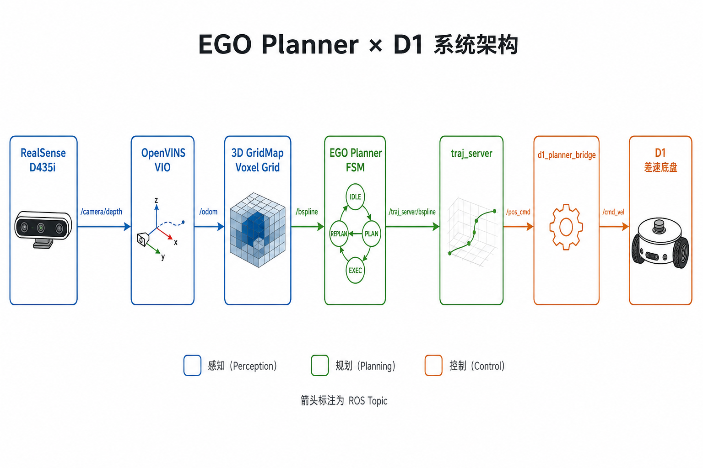
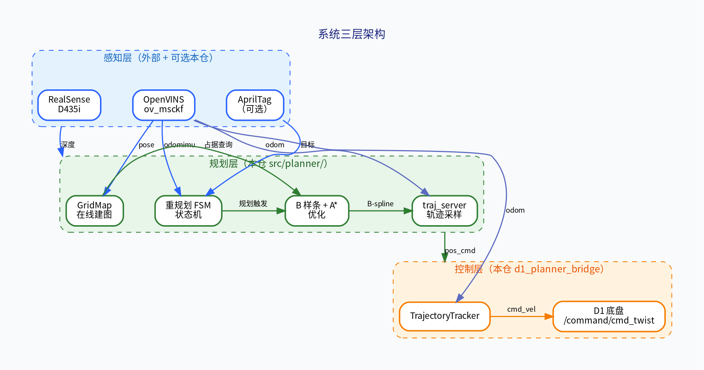
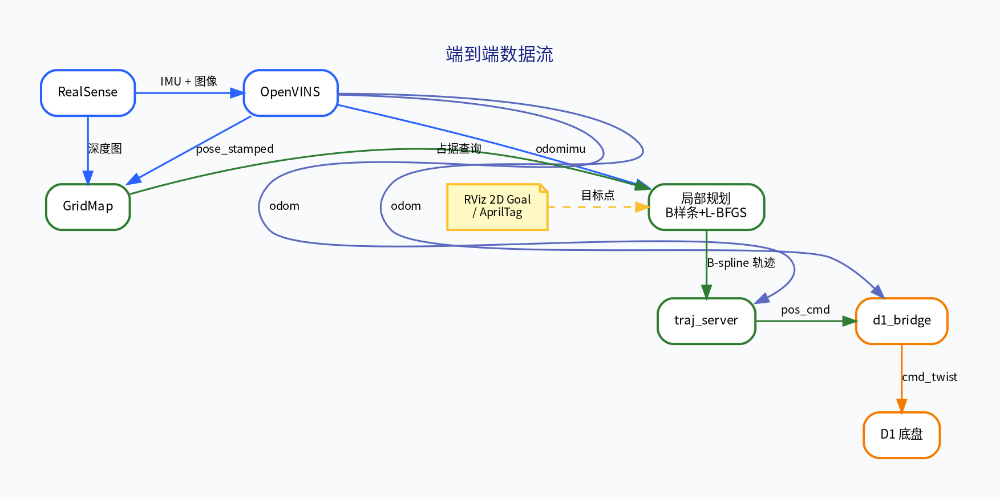
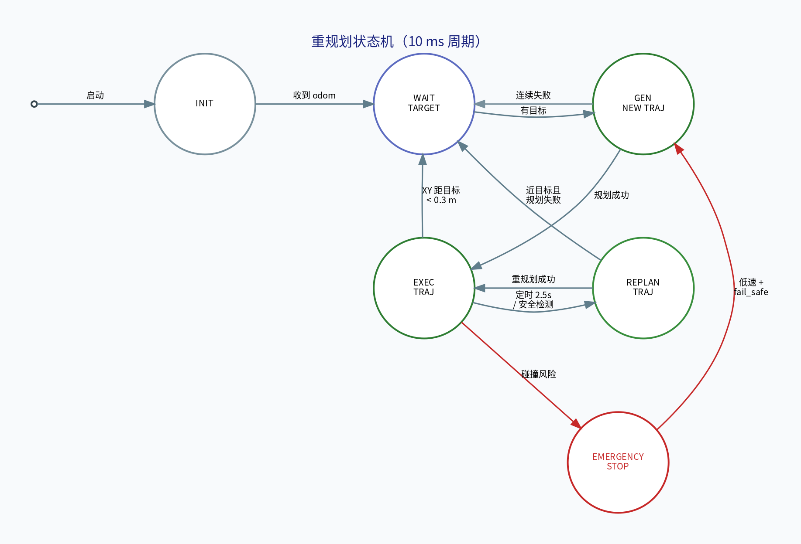
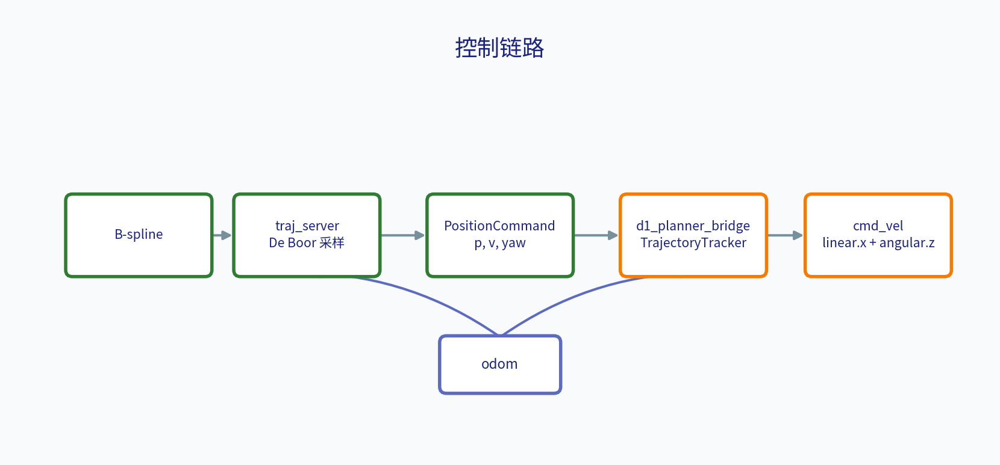

# D1 实机 Demo 指南

> 面向首次接触本项目的开发者与演示人员：架构、运行流程与关键技术点。  
> 编译与依赖见 [Readme.md](../Readme.md)；细节见 [系统总览](00_overview.md)、[规划原理](01_planning_math.md)、[控制原理](02_control_math.md)。

---

## 1. 项目是什么？

**ego_control** 是一个 ROS 2 Humble 工作区，将 **在线避障局部规划**（动态 A\* + 均匀 B 样条 + L-BFGS）部署到 **D1 地面差速机器人**。

| 能力 | 说明 |
|------|------|
| 在线感知建图 | RealSense D435i 深度 + OpenVINS VIO → 3D 体素占据；地面滤波 + 高度柱 |
| 实时避障规划 | 固定高度 XY 优化 + FSM 重规划与安全分层 |
| 底盘执行 | `traj_server` 采样 → `d1_planner_bridge` 转 `cmd_vel` |
| 可选 AprilTag 跟随 | 检测 Tag 后自动导航至目标距离 |

**一句话概括**：相机看路、VIO 定位、B 样条避障规划、桥接节点驱动 D1 底盘。

---

## 2. 系统架构

<p align="center">
  
</p>

### 2.1 三层结构

<p align="center">
  
</p>

### 2.2 仓库目录结构

```
ego_control/
├── start_ego_stack.sh          # 一键启动（实机推荐）
├── Readme.md
├── docs/
└── src/
    ├── planner/                # 规划栈（C++）
    │   ├── plan_manage/        # FSM、节点、launch、d1_robot.yaml
    │   ├── plan_env/           # GridMap
    │   ├── bspline_opt/        # B 样条 L-BFGS
    │   ├── path_searching/     # 动态 A*
    │   └── traj_utils/
    ├── d1_planner_bridge/      # 差速跟踪
    ├── perception/apriltag_detect/
    └── quadrotor_msgs/
```

### 2.3 兄弟工作区依赖

```
d1robot/
├── realsense/
├── openvins/
└── ego_control/   # 本仓库
```

---

## 3. 数据流与话题

<p align="center">
  
</p>

| 话题 | 类型 | 方向 | 说明 |
|------|------|------|------|
| `/ov_msckf/odomimu` | Odometry | VIO → 规划/控制 | 全局系位姿与速度 |
| `/ov_msckf/pose_stamped` | PoseStamped | VIO → GridMap | 深度投影建图 |
| `/camera/camera/depth/image_rect_raw` | Image | RealSense → GridMap | 16UC1 深度（mm） |
| `/move_base_simple/goal` | PoseStamped | RViz → FSM | 手动设目标点 |
| `drone_0_planning/bspline` | Bspline | planner → traj_server | 优化后轨迹 |
| `/drone_0_planning/pos_cmd` | PositionCommand | traj_server → bridge | 位置/速度/yaw |
| `/command/cmd_twist` | Twist | bridge → D1 | `linear.x` + `angular.z` |
| `/apriltag/target_pose_global` | PoseStamped | Tag → FSM | 追踪模式目标 |

---

## 4. 规划状态机（FSM）

重规划 FSM（`ego_replan_fsm.cpp`）每 **10 ms** 运行一次：

| 状态 | 含义 |
|------|------|
| `INIT` | 启动，等待里程计 |
| `WAIT_TARGET` | 有定位，等待 RViz 目标或 Tag |
| `GEN_NEW_TRAJ` | 首次规划 / 急停恢复 |
| `REPLAN_TRAJ` | 局部 warm-start 重规划 |
| `EXEC_TRAJ` | 执行已发布 B 样条 |
| `EMERGENCY_STOP` | 碰撞风险，发布停车轨迹 |

<p align="center">
  
</p>

**D1 适配要点**：

- **2.5D**：优化锁 z；碰撞用高度柱
- **Odom 锚定**：起点为 odom，重规划前 3 控制点钉 odom
- **到达判定**：仅 XY（默认 0.3 m）
- **Odom 进度采样**：避免「时间播完车未走到」
- **安全分层**：`[SAFETY_TIER]` 优先 replan / 停车样条，再急停

---

## 5. 规划算法流程

一次 `reboundReplan()` 分三步：

<p align="center">
  
</p>

| 模块 | 包 | 职责 |
|------|-----|------|
| 占据地图 | `plan_env` | 深度 raycast → 体素；地面滤波；柱查询 |
| 路径搜索 | `path_searching` | 动态 A\* 提供优化初值方向 |
| 轨迹优化 | `bspline_opt` | 均匀 B 样条 + L-BFGS |
| 轨迹执行 | `traj_server` | De Boor 采样 → PositionCommand |

---

## 6. 控制链路

<p align="center">
  
</p>

**TrajectoryTracker**（当前精简律）：

1. 世界系速度 → 车体前进方向（body +Z 水平投影）→ `linear.x`
2. 航向 P + `yaw_dot` 前馈 → `angular.z`；大航向误差原地转
3. 看门狗：`pos_cmd` / odom 超时强制零速

---

## 7. Demo 操作

```bash
./start_ego_stack.sh                        # RViz 2D Goal
./start_ego_stack.sh enable_tag_tracking=true
./start_ego_stack.sh --no-rviz
```

| 步骤 | 操作 |
|------|------|
| 1 | 等待 VIO 初始化（轻微移动相机） |
| 2 | RViz Fixed Frame = `global`，2D Goal 设点 |
| 3 | XY 距目标 < 0.3 m 后停车 |

Tag 模式：距 Tag ≤ 0.25 m 停车。日志：`ego_log/stack_YYYYMMDD_HHMMSS/`。

---

## 8. 关键技术点速查

### 8.1 空中 3D → 地面差速

| 通用空中范式 | D1 适配 |
|--------------|---------|
| 3D 全空间规划 | 固定 z 优化 + 高度柱碰撞 |
| 位置/速度高层指令 | 差速 `cmd_vel`（vx + wz） |
| 时间进度采样 | Odom 空间进度采样 |
| 3D 到达判定 | XY 距离判定 |
| 静态地图 | 在线深度建图 |

### 8.2 在线建图（GridMap）

- 地图约 40×40×3 m；膨胀默认 **0.20 m**
- 地面滤波 + 高度柱：见 [06_ground_obstacle_modeling.md](06_ground_obstacle_modeling.md)

### 8.3 急停

1. **规划侧**：`EMERGENCY_STOP` → 6 点重合停车样条；`[SAFETY_TIER]` 分层
2. **执行侧**：终点附近零速 + 看门狗超时零速

### 8.4 参数入口

| 文件 | 内容 |
|------|------|
| `d1_robot.yaml` | **核心单一配置源** |
| `d1_bridge.yaml` | 跟踪增益、看门狗 |

限速默认：`max_vel=0.6`，`max_wz=0.5`，`max_acc=1.0`，`goal_reach_thresh=0.3`，`tag_stop_dist=0.25`，`thresh_replan_time=2.5`。

---

## 9. 常见问题

| 现象 | 可能原因 | 建议 |
|------|----------|------|
| 栈启动卡住 | VIO/深度未就绪 | 查 RealSense / OpenVINS 日志 |
| RViz 无点云 | Fixed Frame 不对 | 选 `global` |
| 机器人不动 | VIO 未初始化 | 移动相机 |
| 一冲一停 | 重规划过频 / 只转不走 | 增大 `thresh_replan_time`；调 `align_heading_*` |
| 规划失败 | 目标在障碍内 | 重设点或清障 |
| 突然零速 | 看门狗 | 查 `[watchdog]` 与话题频率 |

---

## 10. 文档索引

| 文档 | 内容 |
|------|------|
| [Readme.md](../Readme.md) | 编译、运行 |
| [00_overview.md](00_overview.md) | 系统总览 |
| [01_planning_math.md](01_planning_math.md) | 规划数学 |
| [02_control_math.md](02_control_math.md) | 控制数学 |
| [06_ground_obstacle_modeling.md](06_ground_obstacle_modeling.md) | 地面矮障 |
| [todo.md](todo.md) | 改进路线 |
| [04_apriltag_integration.md](04_apriltag_integration.md) | AprilTag |
| **本文** | Demo 指南 |
