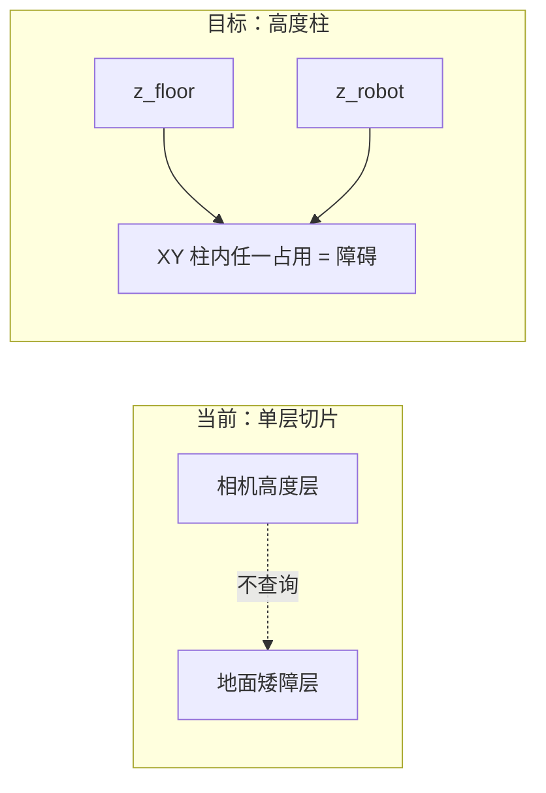

# 地面障碍与世界坐标建模（修改方向）

本文说明 D1 实机在 **VIO 原点≈相机**、**机身可抬升** 条件下，当前障碍取舍为何会系统性漏掉贴地矮障，以及推荐的建图 / 规划建模方向。  
**状态：设计说明，尚未落地实现。**

相关现状见：[系统总览 § 建图与固定 Z 规划](00_overview.md)、[规划数学 §6 固定 z 的 2.5D](01_planning_math.md)。

---

## 1. 问题背景

### 1.1 坐标系事实

OpenVINS 初始化后，世界系 `global` 原点通常落在 **当时的相机（IMU）位姿** 上：

- 初始化瞬间：相机世界坐标 ≈ `(0, 0, 0)`
- 若 Z 朝上：真实地面约在 `z ≈ -h_cam`（`h_cam` = 相机离地安装高度，常见 0.2～0.4 m）
- 机身抬升后：相机 `z` 升高；地面障碍的世界 `z` **基本仍停在低处**

世界原点在相机 **可以保留**（改 TF 成本高）。问题出在「地面高度」与「碰撞查询高度」的建模，而不是原点选错。

### 1.2 当前配置隐含的错误假设

| 机制 | 当前典型值 | 隐含假设 | 实机后果 |
|------|------------|----------|----------|
| `grid_map/ground_height` | `-0.01` | 地面 ≈ 略低于相机 init | 真实地面 / 矮障在 `z≈-h_cam`，**一初始化就低于地图下界 → out of map，不入库** |
| `manager/use_robot_z_planning` | `true` | 只查 `planning_z` = 相机高度一层 | 矮障即便进图，也在低层；抬高后切片更碰不到 |
| `grid_map/inflate_xy_only` | `true` | 膨胀只在同一 z 层 XY 扩张 | 低层障碍 **不会** 胀到相机高度层 |
| `ground_filter_enable` | `false` | 暂不把贴地点当地板滤掉 | 方向对，但地图下界先切掉了贴地物，滤不滤都无从谈起 |

结论（实机）：

> 原点在相机 + 地图下界≈0 + 规划只查相机高度层  
> → **贴地微小障碍必然进不了有效避障闭环**；机身抬升只会加重。

这与「相机光学近场盲区」是两件事：盲区是感知几何问题；本文针对的是 **已经投到世界系的点，被地图/规划逻辑系统性丢掉**。

---

## 2. 目标语义（应区分的三层）

```text
世界 z ≈ 0          初始化相机高度（随 VIO 漂移）
世界 z ≈ -h_cam     真实地面带
地图 Z 覆盖         必须包含 [地面以下余量, 机身顶部以上]
障碍                相对地面凸起超过阈值的物体（不是「略低于相机的一切」）
规划碰撞            机身在 XY 占据柱内是否碰到障碍（不是单层相机切片）
```

| 概念 | 应用义 | 不应用义 |
|------|--------|----------|
| 世界原点 | VIO `global`，可仍为相机 init | 不必强行改到地板原点 |
| `ground_height` | 地图 **Z 下界**，应罩住真实地面 | 不是「相机以下 1 cm」 |
| 地面滤波 | 去掉近似地面平面的点，保留凸起 | 不是用 out-of-map 一刀切掉低 z |
| `planning_z` | 机身/相机当前高度的参考 | 不能作为唯一碰撞查询高度 |

---

## 3. 推荐修改方向

### 3.1 世界坐标与地图 Z 范围

**保留** `/ov_msckf/pose_stamped`、`/ov_msckf/odomimu` 的 `global` 定义。

将地图下界改为按安装高度设定，例如：

\[
\text{ground\_height} \approx -(h_{\text{cam}} + \delta_{\text{margin}})
\]

- `h_cam`：相机名义离地高度（实机测量）  
- `\delta_margin`：VIO 下漂与地面不平余量（如 0.05～0.15 m）  
- 上界：现有 `map_size_z` / `virtual_ceil_height` 覆盖抬升后相机与顶部余量  

示例：`h_cam ≈ 0.25` → `ground_height ≈ -0.40 ~ -0.50`（具体值以测量为准）。

同时：规划用的 `planning_z` 应 **clamp 进地图 Z**（`≥ ground_height + ε`），避免 VIO 下漂导致整轨 `getInflateOccupancy → -1` 被当成障碍（见实机 log 中 `goal.z ≈ -0.04` vs `ground_height = -0.01`）。

### 3.2 建图：障碍选取（贴地取舍）

在深度点已落入地图 Z 内的前提下：

1. **入库范围**：世界 `z ∈ [地面带, 顶部]`。  
2. **地面滤波（建议参数化重开，阈值收紧）**：
   - 仅将「接近估计地面、且凸起高度 &lt; `obstacle_min_height`」的点视为地板（free / miss）  
   - **高于地面超过阈值** 的点保留为障碍  
3. **不要** 用「略低于相机即 out of map」代替地面滤波。  
4. 近机身仍可用 `depth_filter_mindist` + footprint 豁免处理自遮挡（与贴地障碍正交）。

### 3.3 规划：碰撞模型（抬升后仍能躲矮障）

地面机器人应改为 **高度柱 / 2.5D**，二选一或组合：

**方案 A — 查询时柱检查（改规划查询）**

对查询点 `(x, y)`，在高度区间

\[
[z_{\text{floor}}+\varepsilon,\ z_{\text{robot}}]
\quad\text{或}\quad
[z_{\text{robot}}-h_{\text{body}},\ z_{\text{robot}}+h_{\text{clear}}]
\]

内任一膨胀占据格占用 → 该 XY 算障碍。  
机身抬升时柱上沿跟着 `z_robot` 走，柱下沿仍接地面带 → 矮障仍可见。

**方案 B — 建图时压成 XY 占据（改膨胀）**

对每个 XY，若高度柱内存在占用，则将该柱（或到 `z_robot`）写入 inflate / 单独 2D 层；规划仍可走「固定 z」接口，但语义已是 2.5D。

**不推荐（当前行为）**

- 仅 `checkOccupancy` 在 `planning_z` 单层查询  
- 且 `inflate_xy_only` 不在 Z 向打通  



### 3.4 与机身 footprint 的关系

Footprint（`robot_footprint_*` / `no_inflate` / `clear_margin`）解决的是 **机身自占据不当膨胀种子、洞边假墙**，属于水平向自我滤除。

本文方向解决的是 **垂直向：地面带障碍如何进入地图并被规划看见**。两者互补，不可互相替代。

---

## 4. 建议落地顺序（实施时）

1. **参数**：按实测 `h_cam` 下调 `ground_height`；确认矮障点能进 `occupancy`（可用 RViz 原始占据，不仅 inflate）。  
2. **安全**：`planning_z` clamp 进地图，消除「整轨 out of map」。  
3. **规划**：实现高度柱查询或 Z 向柱膨胀（优先 A 或 B 之一）。  
4. **可选**：收紧后重开 `ground_filter`，用「离地高度阈值」区分地板与矮障。  
5. **回归**：机身低位 / 抬升各测一轮贴地盒、门槛；确认抬高后仍绕障，且地板不被铺成满墙。

---

## 5. 验收标准（实机）

| 场景 | 期望 |
|------|------|
| 初始化后地面附近矮盒（高于 `obstacle_min_height`） | 占据图低层可见；规划绕行或停障 |
| 机身抬升后同矮盒 | 仍被当作障碍（柱查询 / 2.5D），不「穿过去」 |
| 平坦地面 | 不因地面点铺满膨胀墙 |
| VIO `z` 略低于 0 | 不触发整轨 `drone is in obstacle`（out-of-map 误判） |

---

## 6. 相关参数（现状索引）

配置源：`src/planner/plan_manage/config/d1_robot.yaml`

| 参数 | 现状角色 | 修改时注意 |
|------|----------|------------|
| `grid_map/ground_height` | 地图 Z 下界 | 改为 `-(h_cam+margin)` |
| `planner/map_size_z` | 地图高度跨度 | 覆盖抬升后相机 |
| `manager/use_robot_z_planning` | 碰撞压到 `planning_z` | 保留需配合柱查询；或改为柱语义 |
| `grid_map/inflate_xy_only` | XY 向膨胀 | 柱模型下评估是否仍适用 |
| `grid_map/ground_filter_*` | 贴地滤波 | 先扩地图下界，再谨慎重开 |
| `grid_map/depth_filter_mindist` | 近距丢弃 | 自遮挡；不解决贴地入库 |
| `grid_map/robot_footprint_*` | 机身水平豁免 | 与本文正交 |

相机世界位姿话题：`/ov_msckf/pose_stamped`（建图 `pose_type: 1` 同步源）。

---

## 7. 一句话

> 原点可以在相机；地图必须罩住真实地面；障碍按离地凸起选取；规划用「地面→机身」高度柱（或等价 2.5D），而不是「相机高度单层切片」。
