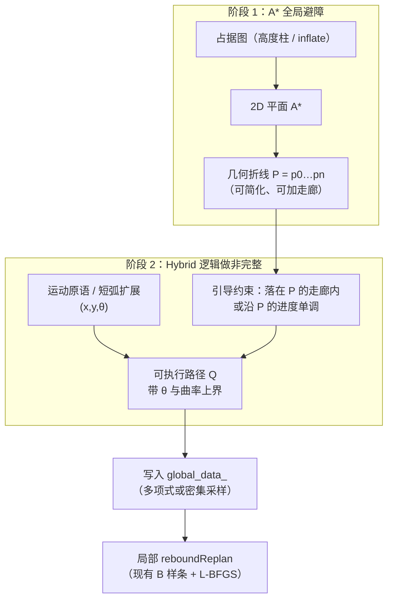

# 全局 A\* 避障 × Hybrid A\* 非完整约束：融合说明

本文说明标准 **A\*** 与 **Hybrid A\*** 各自解决什么问题，以及在本仓库 D1 栈上如何融合：

- 用 **A\*** 做 **全局几何避障**（拓扑绕行）
- 用 **Hybrid A\* 的运动学逻辑** 解决 **质点建模不可执行**（差速不能横移、转弯有曲率）

**不主张**把整图开环 Hybrid A\* 当作唯一全局规划器（你已倾向：避障拓扑用 A\* 即可）。

相关现状：[规划数学](01_planning_math.md)、[改进路线](todo.md)、当前全局层 `planGlobalTraj`（直线插点 + min-snap）。

---

## 1. 标准 A\* 怎么做

### 1.1 状态与扩展

| 项 | 内容 |
|----|------|
| 状态 | 离散栅格 $(i,j)$ 或 $(i,j,k)$，对应世界系 $(x,y)$ / $(x,y,z)$ |
| 边 | 邻域（4/8/26 连通）：一步跳到相邻格心 |
| 代价 | 通常均匀边权 + 启发式（欧氏 / 对角 / 曼哈顿） |
| 输出 | 栅格折线（再映射为世界系折线） |

本仓库局部已有：`path_searching/dyn_a_star.cpp`（平面模式下等价 8 邻域 2D A\*），目前主要用于 **局部 rebound 初值方向**，**不是**全局 `planGlobalTraj`。

### 1.2 它擅长什么

- 在膨胀占据图上找 **连通自由空间** 的最短（或近最短）路径
- 复杂度相对低，适合做全局 / 启发式地图

### 1.3 质点问题（核心缺陷）

栅格 A\* 把机器人当 **质点（或各向同性圆）**：

- 任意邻格跳转 ≈ 允许「瞬间改向」「斜向/横向挪格子」
- **没有航向 $\theta$**，也没有最小转弯半径
- 折线在尖角处曲率无穷大 → 差速底盘 **几何上穿障自由，运动学上常不可跟**

因此：A\* 适合回答「障碍之间怎么绕过去」；不适合单独回答「车头朝哪、怎么转过去」。

---

## 2. 标准 Hybrid A\* 怎么做

### 2.1 状态与扩展

| 项 | 内容 |
|----|------|
| 状态 | 连续/半连续 $(x, y, \theta)$（位置量化到栅格，航向离散成若干 bin） |
| 边 | **运动原语**：按自行车 / 差速模型积分一小段（左转、直行、右转等），得到可行位姿 |
| 解析扩展 | 接近终点时用 Reeds-Shepp / Dubins 等解析曲线接到目标位姿 |
| 启发式 | 常见双启发式：无障非完整距离（RS/Dubins）∩ 有障 2D 距离（用 **普通 A\*/Dijkstra** 预计算） |
| 输出 | 带航向的可行路径（一段段圆弧/短轨迹拼接） |

经典实现思路见 Stanford Junior 的 Hybrid A\*、Nav2 SMAC Hybrid-A\* 等。

### 2.2 它相对 A\* 多解决了什么

- **非完整约束**：扩展边本身就是车能开的动作 → 缓解质点建模
- **终点航向**：可规划到 $(x_g,y_g,\theta_g)$，而不只是到点
- 路径已带 $\theta$，便于下游跟踪 / 作 B 样条初值

### 2.3 为何不必「整图只用 Hybrid A\* 做避障拓扑」

- 搜索维数更高（多了 $\theta$），实时代价更大
- 障碍拓扑往往被 **2D 自由空间连通性** 决定；Hybrid 在困难窄廊里也可能反复试原语
- 工程上常见做法本来就是：**2D 距离场 / A\* 当启发式或引导**，Hybrid 负责可执行性——这已经是一种融合

你的判断可以概括为：

> 避障「走哪条走廊」用 A\*；「走廊里怎么把车开过去」用 Hybrid 的运动学逻辑。

---

## 3. 两者能力对照

| 问题 | 标准 A\* | 标准 Hybrid A\* |
|------|----------|-----------------|
| 全局绕障拓扑 | 强 | 有，但更贵；常依赖 2D 启发 |
| 质点 / 可横移假设 | 有（问题） | 基本消除 |
| 显式航向 / 曲率 | 无 | 有 |
| 输出适合差速跟踪 | 差（尖折线） | 较好 |
| 与本仓局部 B 样条 | 可作折线引导 | 可作带 $\theta$ 的更可执行初值 |

---

## 4. 推荐融合：两阶段「A\* 拓扑 + Hybrid 可执行化」

目标接口（替换当前「直线插点 + min-snap」全局层）：

```text
输入:  start (x,y,θ), goal (x,y[,θ]), 膨胀/柱占据图
输出:  全局参考 —— 建议为带航向的折线/短原语链，或再 min-snap / 参数化成多项式
下游:  getLocalTarget() 仍切片；reboundReplan 仍做局部避障与光滑
```



### 4.1 阶段 1 — 只要 A\* 的避障（**已落地**）

入口：`EGOPlannerManager::planGlobalTraj` → `buildGlobalWaypoints` + `fitGlobalPolynomial`。

行为：

1. 直线通畅则跳过搜索（短距加速）
2. 否则用独立 `global_a_star_`（大 pool、可配置超时）在膨胀/柱占据上平面搜索
3. RDP 简化折线 → 按 `global_astar_insert_dist` 加密 → 现有 min-snap 写入 `global_data_`
4. 失败时可 `global_astar_fallback_straight` 回退直线

参数（`d1_robot.yaml` → `manager/`）：`global_astar_enable`、`global_astar_step`、`global_astar_timeout`、`global_astar_fallback_straight`、`global_astar_simplify_eps`、`global_astar_insert_dist`。

局部 rebound 用的 `bspline_optimizer_->a_star_`（小池）**不变**。

下一阶段再做 Hybrid 可执行化（§4.2）。

#### ~~阶段 1 设计备忘（实现前）~~

- ~~在膨胀占据图上跑平面 A\*~~ → 已实现
- ~~起终点：当前 odom → `end_pt_`~~ → 已实现
- ~~后处理：路径简化~~ → RDP `simplify_eps`
- ~~输出 $P$ 只表达「绕哪些障」~~ → 已实现；min-snap 仍只做时空平滑

### 4.2 阶段 2 — Hybrid 可执行化

#### 方案 L（轻量）— **已落地**

参数（`d1_robot.yaml` → `manager/`）：

| 参数 | 默认 | 含义 |
|------|------|------|
| `hybrid_enable` | true | 总开关 |
| `hybrid_max_curvature` | 0.83 | $\kappa_{\max}\approx$max_wz/max_vel |
| `hybrid_corner_angle_thresh` | 0.5 | 超过此转角才修圆（rad） |
| `hybrid_arc_sample_step` | 0.2 | 圆弧采样步长（m） |
| `hybrid_max_arc_points` | 30 | 单拐角最多点数 |
| `hybrid_use_odom_start_yaw` | true | 起点用车头航向 |
| `hybrid_blend_start_yaw` | true | 车头与首段切向差大时插入对准弧 |
| `hybrid_align_yaw_thresh` | 0.4 | 对准阈值（rad） |

实现：`EGOPlannerManager::applyHybridCurvatureL`（A\* 折线之后、min-snap 之前）。日志：`[hybrid_L]`。

#### 方案 M / H（未做）

1. 阶段 1 得折线 $P$ 与走廊  
2. 状态 $(x,y,\theta)$，用 **差速 / 自行车运动原语** 扩展  
3. 扩展节点若偏离 $P$ 超过走廊半宽 → 剪枝或加重代价  
4. 启发式：沿 $P$ 的剩余弧长 + 航向误差（可再加 2D A\* 距离）  
5. 近终点可用解析曲线接到目标 $\theta$（可选）

**融合点：**

- **避障拓扑** 几乎由 A\* 走廊决定（你要的 A\* 全局避障）  
- **扩展边** 全是可行运动（你要的 Hybrid 去质点）  
- 搜索空间远小于「整图 Hybrid A\*」

#### 方案 H（完整 Hybrid A\*，A\* 仅作启发）

标准 Hybrid：整图运动原语搜索，2D A\* 只当启发式。  
与「全局避障用 A\*」叙事不完全一致，仅当走廊方案失败时的 **fallback**。

### 4.3 和本仓库局部层怎么接

| 层 | 现在 | 融合后建议 |
|----|------|------------|
| `planGlobalTraj` | 直线点 + min-snap | **平面 A\* 折线 + min-snap**（已落地）；Hybrid 可执行化待做 |
| `getLocalTarget` | 沿全局时长 / 弧长切片 | 不变；全局变「可绕障 + 更可开」后局部目标更合理 |
| `reboundReplan` 初值 | 多项式 / warm-start + **局部** A\* rebound | 保留；全局更好后局部失败率应下降 |
| 局部 `dyn_a_star` | rebound 弹性方向 | **继续保留**（局部贴障），与全局 A\* 分工不同 |

注意：**全局 A\* 与局部 rebound A\* 可以是同一套栅格查询，但调用场景不同**，不要混成一次搜索。

---

## 5. 「只融逻辑、不混成一个算法」的边界

| 保留自 A\* | 保留自 Hybrid A\* | 明确丢掉 / 弱化 |
|------------|-------------------|------------------|
| 2D 栅格最短路避障 | 状态含 $\theta$ | 用 Hybrid 在整图上「自己找拓扑」当默认 |
| 占据 / 柱碰撞查询 | 运动原语扩展（或等价曲率约束） | 质点 8 邻域当作可执行全局轨迹 |
| 低维、快 | 终点可带航向 | 认为 min-snap  alone 能解决不可横移 |

一句话公式：

$$
\text{全局参考} = \underbrace{\mathrm{A^*}}_{\text{自由空间拓扑}} \;+\; \underbrace{\mathrm{Hybrid\text{-}kinematics}}_{\text{可执行化}} \;\;\xrightarrow{\text{切片}}\;\; \underbrace{\mathrm{B\text{-}spline rebound}}_{\text{局部光滑与再避障}}
$$

---

## 6. 差速 D1 上的建模要点（阶段 2 实现时）

- 前进为主（与 bridge `allow_reverse=false` 一致时，原语可先只做正向弧，必要时再开 Reeds-Shepp 倒车）  
- 最大曲率约 $\kappa_{\max} \sim \omega_{\max} / v$（与 `max_wz`、巡航速度相关）  
- 原语长度与栅格分辨率同量级或略大，避免状态爆炸  
- 起点 $\theta$：用 odom 的 **body +Z 水平投影航向**（与 bridge 一致），不要 silently 用质点折线切向代替当前车头  

---

## 7. 建议落地顺序

1. **只换阶段 1**：**已落地**（平面 A\* + min-snap）  
2. **加方案 L**：**已落地**（曲率修圆 + 起点航向对准）——实机微调 `hybrid_max_curvature` / `corner_angle_thresh`  
3. **上方案 M**：走廊内运动原语搜索  
4. 方案 H 仅作失败兜底  

验收可对照 [03_planning_metrics.md](03_planning_metrics.md)：全局重建后 `reboundReplan` 成功率、初值碰撞率、急停次数、桥接航向误差。

---

## 8. 和文档中「Hybrid A\*」条目的关系

[todo.md](todo.md) 里 Hybrid A\* 仍可作为学习对象；**工程默认叙事改为本文的融合**，而不是「用 Hybrid 替换一切全局规划」。

若只改一处代码入口：优先 `EGOPlannerManager::planGlobalTraj` / FSM 里调用它的 `planNextWaypoint`、`forceReplanGlobalFromOdom`、`maybeReplanGlobalAfterEstop`。

---

## 9. 小结

- **A\***：解决「障从哪边绕」——质点、无航向  
- **Hybrid A\***：解决「车怎么转过去」——$(x,y,\theta)$ + 运动原语  
- **融合**：A\* 出拓扑与走廊；Hybrid 的运动学逻辑在走廊内（或轻量曲率修正）生成可执行全局参考；局部 B 样条 rebound 照旧  

这与「全局要 A\* 避障、但要保留 Hybrid 去质点」的目标一致，且比整图 Hybrid A\* 更贴合当前 D1 实时栈。
