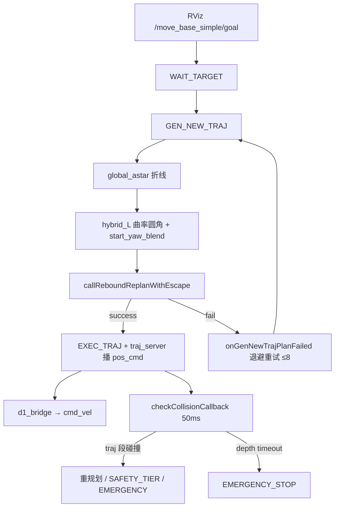

# 近障起步规划失效与撞障分析

本文结合当前 FSM / 建图 / hybrid 初值 / rebound / 安全层逻辑，说明：**到点停速闩锁已修好之后**，为何在「障碍离起点很近」时给新目标仍会撞上。  
实机证据来自 `ego_log/stack_20260729_145142`。

相关文档：[系统总览](00_overview.md)、[地面障碍建模](06_ground_obstacle_modeling.md)、[A\* + Hybrid 融合](07_astar_hybrid_fusion.md)、[规划数学](01_planning_math.md)、[近障贴障时间过长](09_near_obstacle_dwell.md)（门禁落地后的通行侧效应）。

---

## 1. 现象摘要

| 阶段 | 结果 |
|------|------|
| 第一次 / 第二次到点 | `[goal_reached]` → `[stop_traj]` → `[traj_hold_stop]`，`plan_vel` 保持 0，漂出 0.3 m 也不回弹 |
| 第二次到点后给新目标 | 起点旁有近障碍；`GEN_NEW_TRAJ` 多次 `plan_success=0` |
| 重试后仍发出轨迹 | `traj_id=53/54` 执行约数秒后 odom `z` 崩到负值，随后 `Depth Lost! EMERGENCY_STOP` |

结论：**停速收尾逻辑正常**；问题在 **近障条件下的首段规划 + 执行期安全拦截不足**。

---

## 2. 当前相关链路（已有逻辑）

### 2.1 从新目标到执行



代码入口：

- 新目标：`waypointCallback` → `planNextWaypoint` → `have_target_=true`
- `WAIT_TARGET` → `GEN_NEW_TRAJ`：`planFromGlobalTraj(10)` → `callReboundReplanWithEscape`
- 成功则 `EXEC_TRAJ`；失败走 `onGenNewTrajPlanFailed`（最多 `gen_new_traj_max_failures: 8`）

### 2.2 初值路径：A\* → Hybrid-L

配置（`d1_robot.yaml`）：

- `global_astar_enable: true`，失败时 `fallback_straight: true`
- `hybrid_enable: true`，`hybrid_blend_start_yaw: true`
- `hybrid_align_yaw_thresh: 0.4` rad；`hybrid_max_curvature: 0.83` → 名义转弯半径 \(R\approx 1.2\,\mathrm{m}\)

`applyHybridCurvatureL` 在 **当前机身航向与首段路径夹角 > align_thresh** 时，插入一段半径约 1.2 m 的圆弧把机头对齐到路径（日志 `[hybrid_L] start_yaw_blend dyaw=...`）。  
近障场景下这段大圆弧会扫过起点侧向空间，很容易切入已建图障碍。

### 2.3 Rebound 优化对「起点在障」的态度

`bspline_optimizer` 碰撞检查大致分档：

1. **机身已在膨胀占据内**（`getInflateOccupancyNoFootprint`）：`Start in obstacles (body occupied), abort` → 本次规划失败。
2. **前 3 个控制点贴障但机身尚自由**：`First 3 cps near obstacle but body free, restart` → 继续迭代。
3. 优化中持续碰撞：打印 `collided, keep optimizing`；最终可 `plan_success=0`。

`callReboundReplanWithEscape` 会依次尝试：

1. （可选）warm-start
2. 多项式初值 rebound
3. **random poly escape**（注释写明：即使 odom 在膨胀边沿也仍尝试）

因此「多次碰撞失败」之后，仍可能在某次重试里得到一条 **形式上 success、几何上仍擦障** 的 B 样条并直接下发。

### 2.4 建图 / footprint 裕度（近障更紧）

当前默认：

- `robot_footprint_no_inflate: true`：机身不当膨胀种子
- footprint box ≈ 前 0.10 / 后 0.20 / 左右各 0.20 m
- `robot_footprint_clear_margin: 0.10`：只清机身洞边假墙

规划查询用膨胀占据，但 **水平安全垫层偏薄**。障碍离起点「比较近」时，A\* 折线与 hybrid 圆弧几乎没有侧向缓冲，优化也难以把轨迹「弹」开。

地面 / 高度柱语义见 [06_ground_obstacle_modeling.md](06_ground_obstacle_modeling.md)；本文焦点是 **XY 近障起步**，不是地面滤波本身。

### 2.5 执行期安全层 `checkCollisionCallback`

周期约 50 ms，逻辑要点：

| 条件 | 行为 |
|------|------|
| `WAIT_TARGET` / `INIT` / 无有效轨迹 | 直接 return |
| `getOdomDepthTimeout()` | 仅在 `EXEC_TRAJ`/`REPLAN_TRAJ` 时 `Depth Lost! EMERGENCY_STOP` |
| `EMERGENCY_STOP` / `GEN_NEW_TRAJ` | **只查机身是否占用，不前向扫描轨迹** |
| `EXEC_TRAJ` / `REPLAN_TRAJ` | 沿当前 B 样条做弧长分段 `checkSegmentInflateOccupied` |

轨迹段撞上时：

1. 先 `planFromCurrentTraj` 尝试重规划；
2. 失败则 `handleTrajHitAfterReplanFailed`：
   - 可选 `SAFETY_HOLD`（停在当前 odom 的 emergency bspline）；
   - 机身在障 + 逼近 → 立即 `EMERGENCY_STOP`；
   - 或失败 streak ≥ `fail_estop_count` → `EMERGENCY_STOP`；
   - 否则转 `GEN_NEW_TRAJ` 重建全局。

**关键缺口**：若发出的轨迹在短时内把车「物理撞上」，VIO/深度先坏掉，安全层可能 **还没打出 `traj_hit`/`SAFETY_TIER`**，就直接变成 `Depth Lost`。撞障在日志里表现为里程计 `z` 失控，而不是清晰的 collision tier。

### 2.6 到点停速闩锁（已修复，对照用）

到达 `goal_reach_thresh` 后：

1. FSM：`have_target_=false`，`publishStopTraj()`，`WAIT_TARGET`
2. `traj_server`：`traj_hold_stop_` 闩锁，`vel≡0` 直到新 B 样条
3. 触发：`endpoint` / `time` / FSM `force`

本次 log 已证明：hold 期间 bridge `plan_vel` 全为 0。  
**近障撞车与停速回弹无关。**

---

## 3. 实机日志时间线（`stack_20260729_145142`）

### 3.1 停速闩锁（对照）

第一次到点（约 `1785308039.76`）：

```text
[goal_reached] dist_xy=0.294 -> WAIT_TARGET
[stop_traj] published
[traj_hold_stop] reason=endpoint ... sticky vel=0
```

随后 `dist_end` 涨到 >0.3，仍 hold；bridge 在 hold→下一目标之间 **max plan_vel = 0**。

第二次到点同样：`reason=time` + `stop_traj`，`hold=1`。

### 3.2 第二次目标：近障大转角初值

起点约 `(5.58,-1.98)`，goal `(1.42,-1.27)`：

```text
[hybrid_L] start_yaw_blend dyaw=-1.79 rad R=1.20 samples=11
[bspline_publish] traj_id=6 ... traj_end=(0.891,-3.430)   # 远偏 goal
```

航向差约 \(103^\circ\)，hybrid 插入大半径起步圆弧；局部终点被拉到 goal 南侧约 2 m。后续多次 replan，`local_target occupied` 频繁出现——说明目标附近 / 路径侧向已贴障。

### 3.3 第三次目标：优化失败 → 仍执行 → 撞崩（主证据）

起点约 `(1.76,-1.12)`（第二次到点后附近），goal `(4.85,-1.88)`：

```text
[global_astar] ok waypoints=4
[hybrid_L] start_yaw_blend dyaw=0.65 rad R=1.20 samples=4
[TRIG] WAIT_TARGET → GEN_NEW_TRAJ

# 多次：
collided, keep optimizing
plan_success=0
refine_success=0
GEN_NEW_TRAJ plan failed (1/8), retry in 0.25s

# 约 0.8s 后仍进入执行：
[bspline_publish] traj_id=53 ... start≈(1.77,-1.12) goal=(4.85,-1.88)
[bspline_publish] traj_id=54 ... p3=(2.215,-1.851) ...  # 快速往南贴障
```

执行中 odom：

| 约时刻 | odom (x,y,z) | 含义 |
|--------|----------------|------|
| 8200.08 | (2.03,-1.41, **0.31**) | 尚正常 |
| 8201.09 | (2.61,-1.83, **0.30**) | 仍正常 |
| 8201.59 | (3.04,-1.56, **0.19**) | z 开始掉 |
| 8202.10 | (3.42,-1.54, **-1.18**) | 位姿发散（撞障/抬轮） |
| 8203.11 | (2.94,-1.34, **-7.04**) | VIO 崩溃 |
| 8204.52 | `Depth Lost! EMERGENCY_STOP` | 深度超时兜底 |

本段 **没有** `[SAFETY_TIER] traj_hit` / `imminent` 日志：安全层未在物理碰撞前完成「轨迹段命中 → 刹停」。

---

## 4. 因果链（结合现有逻辑）

```text
起点近障 / 机头朝向与目标路径夹角较大
        │
        ▼
global_astar 给出折线（几何上「能搜到」）
        │
        ▼
hybrid_L start_yaw_blend 插入大半径圆弧  ──► 初值已可能扫入障碍
        │
        ▼
rebound 反复 collided → plan_success=0
        │
        ├─ 未达 max_failures 前：退避重试
        └─ 某次 escape/重试「成功」──► 发布 B 样条，直接 EXEC_TRAJ
                │
                ▼
traj_server 正常播非零速度；bridge 跟速
                │
                ▼
近障擦碰 / 撞击 → VIO z 崩、深度停更
                │
                ▼
安全层来不及 traj_hit 分级，最终 Depth Lost EMERGENCY_STOP
```

拆开看四层失配：

1. **初值层**：`hybrid_blend_start_yaw` 在近障处无「圆弧是否占障」的硬约束；大 `dyaw` 代价高。
2. **优化层**：贴障时大量 `plan_success=0`，但 `WithEscape` + FSM 重试仍可能放出擦障轨迹；「success」≠「全程可通行裕度足够」。
3. **地图裕度**：`no_inflate` + 小 footprint → 障碍「看起来」离得近时，优化几乎无侧向空间。
4. **安全层**：依赖深度仍有效且能扫描到未来轨迹段；撞瞬间传感器/VIO 先挂，表现为 Depth Lost，而不是规划碰撞刹车。

---

## 5. 与「到点停速」问题的边界

| 问题 | 状态 | 日志特征 |
|------|------|----------|
| 到点后继续发非零 `plan_vel` | **已修** | `traj_hold_stop` + hold 期间 `plan_vel=0` |
| 近障新目标撞障 | **初版已落地（待实机验收）** | 期望见 `[publish_gate]` / `start_yaw_blend skipped` / `odom_anomaly`，不再直接擦障执行 |

不要把第三次目标的 `EMERGENCY_STOP` 误判成停速闩锁失效：estop 前的 `traj_id=56` 是紧急停车轨迹，且立即 `traj_hold_stop reason=endpoint`。

---

## 6. 改进方向（已实现初版）

按侵入性由小到大（对应代码 / `d1_robot.yaml`）：

1. **GEN_NEW 门禁** — **已落地**  
   - `publish_collision_gate_enable`：`callReboundReplan` 发布前对整条 B 样条做硬碰撞扫描，不过则当失败（`[publish_gate]`）。  
   - `near_obstacle_block_escape`：机身在膨胀内时跳过 random poly escape，避免「假成功」。  
   - 达到失败上限仍走原有 `WAIT_TARGET` + 零速。

2. **限制近障大转角起步** — **已落地**  
   - `hybrid_blend_occ_check` + `hybrid_blend_r_shrink_tries`：`start_yaw_blend` 前检查圆弧采样占用；失败则缩 R（0.7 / 0.45），仍占障则跳过 blend（`[hybrid_L] start_yaw_blend skipped`）。

3. **增大贴障水平裕度** — **已落地（保守）**  
   - `obstacles_inflation` 0.10 → 0.12；`robot_footprint_clear_margin` 同步 0.12。

4. **执行期更早刹停** — **已落地**  
   - `estop_imminent_time` 0.30 → 0.45；`safety_fail_estop_count` 3 → 2。  
   - `odom_anomaly_hold_enable`：`|Δz|` 超 `odom_z_jump_thresh` 或 `SUSPECT_JUMP` 且 implied_v 过高 → `EMERGENCY_STOP`（不单靠 Depth Lost）。

5. **近障专用行为** — **已落地**  
   - `near_obstacle_stop_before_plan` + `near_obstacle_check_radius`：GEN_NEW 前若机身在障或半径内有占用且仍在动，先 `callEmergencyStop` 再规划。

复现验收见 §7；关键日志关键字：`[publish_gate]`、`start_yaw_blend skipped`、`[near_obs]`、`odom_anomaly`。

---

## 7. 复现与验证建议

1. 车停在障碍旁（侧向或前方约 <0.5–1 m），RViz 给一个需大转角离开的目标。  
2. 看 planner log：是否出现连续 `collided, keep optimizing` / `GEN_NEW_TRAJ plan failed`，随后是否仍有 `bspline_publish`。  
3. 看是否有 `[hybrid_L] start_yaw_blend` 且 `|dyaw|` 较大。  
4. 撞前是否出现 `[SAFETY_TIER] traj_hit`；若没有而直接 `Depth Lost`，与本次 log 同类。  
5. 对照 hold：到点后应持续 `[traj_hold_stop]` 且 bridge `plan_vel=0`。

---

## 8. 关键文件索引

| 模块 | 路径 |
|------|------|
| FSM / GEN_NEW / 安全 | `src/planner/plan_manage/src/ego_replan_fsm.cpp` |
| Hybrid 起步圆弧 | `src/planner/plan_manage/src/planner_manager.cpp` (`applyHybridCurvatureL`) |
| Rebound 起点占障 | `src/planner/bspline_opt/src/bspline_optimizer.cpp` |
| 停速闩锁 | `src/planner/plan_manage/src/traj_server.cpp` |
| 参数 | `src/planner/plan_manage/config/d1_robot.yaml` |
| 本次 log | `ego_log/stack_20260729_145142/` |
