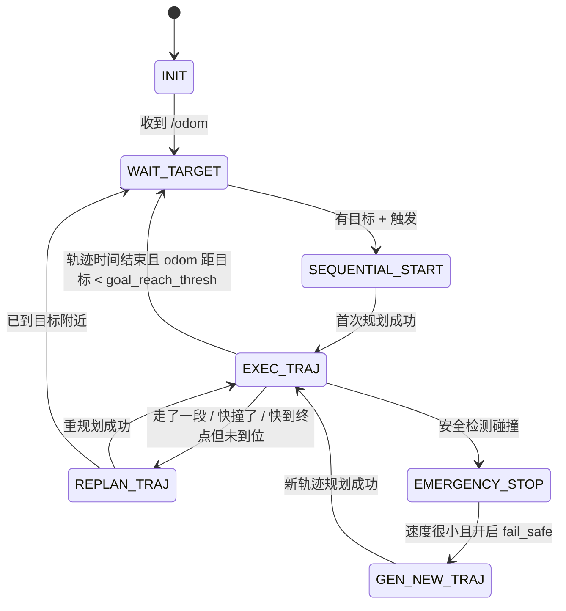
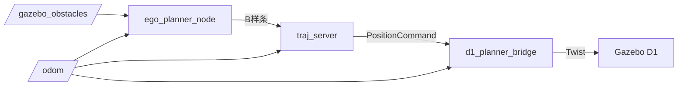

# EGO Planner 与 D1（Gazebo）工作概览

本文说明本仓库里三件事：**地图怎么建**、**规划状态机怎么变**、**控制量怎么送到 Gazebo 里的 D1**。

---

## 1. 地图是怎么建出来的？

EGO 不加载一张事先画好的静态地图，而是在线维护一个 **3D 体素栅格**（`GridMap`，位于 `plan_env` 包）。每个小格子记录“是否被障碍物占据”，规划时用它做碰撞检测和路径优化。

### 用了哪些数据？

在 **D1 + Gazebo** 的默认启动（`single_run_d1.launch.py`）里，主要靠下面两类输入：


| 数据    | 典型话题                | 作用                             |
| ----- | ------------------- | ------------------------------ |
| 里程计   | `/odom`             | 机器人（相机）在世界系中的位置，决定**局部地图更新中心** |
| 障碍物点云 | `/gazebo_obstacles` | 直接把点云里的点标成**占据体素**（并做膨胀）       |


### 建图流程（通俗版）

```
/odom ──────────────► 更新机器人位置，划定“局部更新范围”
/gazebo_obstacles ──► 范围内的点 → 占据体素 + 膨胀 → occupancy_buffer_inflate_
```

**点云模式**（当前 D1 常用）：收到点云后，在机器人周围一块局部区域内，把每个点及其膨胀邻域对应的体素标为障碍（`cloudCallback`）。

规划器读的是膨胀后的占据图，用于 A* 初始路径和 B 样条优化时的避障代价。

---

## 2. EGO 里的“状态”指什么？怎么变？

这里的“状态”是 **有限状态机 FSM**（`EGOReplanFSM`），每 10 ms 跑一次，决定“现在在等什么、要不要重新规划、能不能执行轨迹”。

### 有哪些状态？


| 状态                 | 含义（一句话）                    |
| ------------------ | -------------------------- |
| `INIT`             | 刚启动，等里程计                   |
| `WAIT_TARGET`      | 有定位了，等目标点或触发信号             |
| `SEQUENTIAL_START` | 多机顺序启动时用；单机也会走这里做**第一次规划** |
| `GEN_NEW_TRAJ`     | 从全局路径重新生成一条新轨迹             |
| `REPLAN_TRAJ`      | 在**当前轨迹**基础上局部重规划          |
| `EXEC_TRAJ`        | 正在执行已发布的 B 样条轨迹            |
| `EMERGENCY_STOP`   | 检测到碰撞风险，紧急停车轨迹             |


### 典型变化（单机 D1）




补充说明：

- **目标从哪来**：`flight_type=1` 时在 RViz 点 **2D Goal**（`/move_base_simple/goal`）；`flight_type=2` 用 launch 里预设航点。
- **何时重规划**：执行中若超过 `thresh_replan_time`（D1 默认约 2 s）、或离全局目标还很远、或安全定时器发现前方障碍，会切到 `REPLAN_TRAJ`。
- **何时算到达**：不只看轨迹时间，还会比较 `**/odom` 位置与目标距离** 是否小于 `goal_reach_thresh`（默认 0.3 m），这对慢速地面机器人很重要。

规划成功后，FSM 通过 `planning/bspline`（重映射为 `drone_0_planning/bspline`）把 **B 样条轨迹** 发给下游。

---

## 3. 控制量怎么产生？怎么驱动 Gazebo 里的 D1？

EGO 原本为四旋翼设计，输出的是 **位置/速度/加速度 + 偏航** 的高层指令，而不是差速底盘的 `cmd_vel`。本仓库用 `**d1_planner_bridge`** 做转换。

### 整条链路




### 第一步：`traj_server` 生成 `pos_cmd`

- 订阅：`drone_0_planning/bspline`、`/odom`
- 发布：`/drone_0_planning/pos_cmd`（消息类型 `quadrotor_msgs/PositionCommand`）
- 按 B 样条对时间求导，得到 **位置、速度、加速度、yaw、yaw_dot**
- D1 启用了 `**use_odom_progress`**：播放进度跟机器人真实位置走，而不是纯墙钟时间，避免慢车“轨迹播完了人还没走到”

### 第二步：`d1_planner_bridge` 转成底盘速度

- 订阅：`/drone_0_planning/pos_cmd`、`/odom`
- 发布：`/command/cmd_twist`（`geometry_msgs/Twist`，只用 `**linear.x`** 和 `**angular.z**`）
- 逻辑概要（`trajectory_tracker`）：
  - 仅当 `trajectory_flag == TRAJECTORY_STATUS_READY` 才输出非零速度
  - 前进速度：把 `pos_cmd` 里的世界系 `(vx, vy)` 用当前 `/odom` 的 yaw **投影到车体前向** → `linear.x`
  - 转向：`wz = yaw_rate_ff * yaw_dot + yaw_kp * (cmd.yaw - robot_yaw)`
  - 再按 `max_vx`、`max_wz` 限幅（与规划器 `max_vel` 对齐，默认约 0.6 m/s）

### 第三步：Gazebo 执行

仿真里的 D1 控制器订阅 `/command/cmd_twist`，驱动轮子运动；`/odom` 再反馈给规划器和 bridge，形成闭环。

### 建议一起启动的节点

1. `ego_planner`：`single_run_d1.launch.py`（规划 + 建图 + traj_server）
2. `d1_planner_bridge`：`d1_planner_bridge.launch.py`（或单独 node + `d1_bridge.yaml`）

---

## 4. D1 一冲一停：常见原因与调参

| 现象 | 可先试 |
|------|--------|
| `linear.x` 长期 &lt; 0.05，腿动一下停一下 | `d1_bridge.yaml` 里 `min_vx: 0.08`（过小速度抬到可起步） |
| `angular.z` 一直涨、`yaw_dot=0` | 降低 `yaw_kp`，限制 `max_wz_yaw_p` |
| 约每 2s 顿一下 | 增大 `thresh_replan_time`（`single_run_d1` 默认 4s） |
| 规划速度小、车跟不上轨迹 | 增大 `traj_server/odom_lookahead_time`（默认 0.7s） |
| 通信卡顿 | 使用 CycloneDDS（见仓库 `Readme.md`） |

桥接新增：`cmd_vel_ema_alpha` 平滑重规划带来的速度跳变；`log_cmd_vel_period_ms: 500` 避免刷屏。

---

## 5. 一张表串起来


| 环节   | 节点/模块                           | 关键输入                        | 关键输出                        |
| ---- | ------------------------------- | --------------------------- | --------------------------- |
| 建图   | `GridMap`（在 ego_planner_node 内） | `/odom`，`/gazebo_obstacles` | 局部占据栅格                      |
| 规划状态 | `EGOReplanFSM`                  | 目标、里程计、地图                   | `drone_0_planning/bspline`  |
| 轨迹采样 | `traj_server`                   | bspline，`/odom`             | `/drone_0_planning/pos_cmd` |
| 底盘控制 | `d1_planner_bridge`             | pos_cmd，`/odom`             | `/command/cmd_twist`        |


---

